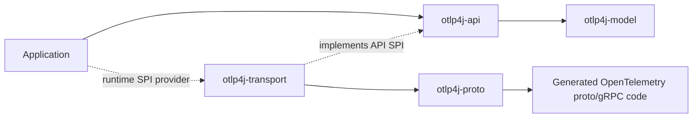

# otlp4j

A JPMS-modular Java SDK for the **OpenTelemetry Protocol (OTLP)**. It exposes a typed Java API for OTLP receivers, exporters, processors, and connectors while keeping generated Protobuf/gRPC code behind a service-provider boundary.

The project is early and not yet published as a release artifact. For now, build it from the reactor or install it into your local Maven repository before experimenting with downstream code.

## What it provides

- A pure Java domain model for traces, metrics, logs, and profiles.
- A user-facing API for receive, process, connect, and export pipelines.
- A built-in plaintext OTLP/gRPC transport discovered through `ServiceLoader`.
- A runnable end-to-end sample that proves the API module can use the transport without compiling against generated proto or gRPC types.

## Module layout

| Module             | Purpose                                                                                |
| ------------------ | -------------------------------------------------------------------------------------- |
| `otlp4j-model`     | JDK-only record model for OTLP resource/scope/signal data.                             |
| `otlp4j-api`       | Public pipeline, receiver, exporter, processor, connector, and transport SPI APIs.     |
| `otlp4j-proto`     | Generated OpenTelemetry proto and gRPC classes, exported only to the transport module. |
| `otlp4j-transport` | Internal OTLP/gRPC client/server and proto/domain mappers.                             |
| `otlp4j-samples`   | End-to-end demo compiled against the API and bound to the transport at runtime.        |
| `otlp4j-testing`   | Shared test fixtures for the reactor.                                                  |
| `otlp4j-coverage`  | Aggregate JaCoCo report module.                                                        |

Runtime dependency reference:



Application code compiles against `otlp4j-api`; `otlp4j-transport` is added when the built-in OTLP/gRPC runtime is needed.

## Requirements

- JDK 25 or newer.
- Maven 3.9.9 or newer. The Maven wrapper currently resolves Maven 3.9.15.

The build enforces these versions and runs Javadoc doclint with warnings promoted to failures for hand-written modules.

## Build and verify

```sh
./mvnw -B verify
```

`verify` compiles all modules, generates proto classes, runs the test suite, checks the configured JaCoCo floors, builds the aggregate coverage report, and lints Javadocs. CI runs the same command.

Useful narrower commands:

```sh
./mvnw -B -pl otlp4j-samples -am test
./mvnw -B -pl otlp4j-api -am test
./mvnw -B -pl otlp4j-transport -am test
```

## Minimal usage

Add the API at compile time and the transport at runtime:

```xml
<dependency>
  <groupId>dev.nthings.otlp4j</groupId>
  <artifactId>otlp4j-api</artifactId>
  <version>0.1.0-SNAPSHOT</version>
</dependency>
<dependency>
  <groupId>dev.nthings.otlp4j</groupId>
  <artifactId>otlp4j-transport</artifactId>
  <version>0.1.0-SNAPSHOT</version>
  <scope>runtime</scope>
</dependency>
```

Create a receiver, process the incoming batch, and export to another OTLP endpoint:

```java
try (var exporter = OtlpGrpcExporter.builder()
        .endpoint("localhost", 4317)
        .build()) {
    var pipeline = Pipeline.builder()
            .process(Processors.setResourceAttribute(
                    "deployment.environment", AttributeValue.of("dev")))
            .process(Processors.filterSpans(span -> span.kind() == Span.Kind.SERVER))
            .into(exporter);

    var receiver = OtlpReceiver.builder()
            .consumer(pipeline)
            .build()
            .start(4318);

    receiver.awaitTermination();
}
```

See [docs/public-api.md](docs/public-api.md) for the public API map and [otlp4j-samples/README.md](otlp4j-samples/README.md) for the runnable end-to-end demo.

## Documentation

- [Architecture](docs/architecture.md): module boundaries, SPI wiring, and transport flow.
- [Public API](docs/public-api.md): user-facing types and extension points.

## Notes & limitations

- The transport is plaintext gRPC; TLS configuration is not yet exposed. A future SPI extension should keep the API module free of direct `io.grpc` dependencies.
- The profiles signal is OpenTelemetry `v1development`. Its domain model (`ProfilesData.Profile`) exposes only stable top-level metadata; domain-to-proto mapping is intentionally lossy for the sample/location/dictionary tables.
- Metric exemplars are not surfaced in the domain model.
