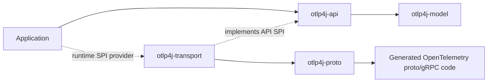

# otlp4j

A JPMS-modular Java SDK for the **OpenTelemetry Protocol (OTLP)**. The public API is built around typed OTLP domain records, asynchronous per-signal consumers, receiver sources, pipeline graphs, connectors, processors, exporters, and a transport SPI that keeps generated Protobuf/gRPC code out of application code.

The project is early and not yet published as a release artifact. For now, build it from the reactor or install it into your local Maven repository before experimenting with downstream code.

## What it provides

- A pure Java domain model for traces, metrics, logs, and profiles.
- Per-signal asynchronous consumers: `TraceConsumer`, `MetricConsumer`, `LogConsumer`, and `ProfileConsumer`.
- Typed `Source<T>` attachment points exposed by receivers and wired with `Pipeline.from(source)`.
- A pipeline graph builder with transforms, filters, observers, explicit fan-out, and lifecycle-aware subscriptions.
- Queue-backed `BatchingProcessor<T>` implementations and built-in transforms for common enrichment/filtering cases.
- Trace-to-metrics and logs-to-metrics connectors for count-derived metrics.
- A live `TelemetryTap` side channel backed by JDK `Flow.Publisher`.
- A built-in OTLP/gRPC transport discovered through `ServiceLoader`.
- A runnable end-to-end sample that proves the API module can use the transport without compiling against generated proto or gRPC types.

## Module layout

| Module             | Purpose                                                                                |
| ------------------ | -------------------------------------------------------------------------------------- |
| `otlp4j-model`     | JDK-only record model for OTLP resource/scope/signal data.                             |
| `otlp4j-api`       | Public pipeline, receiver, exporter, processor, connector, and transport SPI APIs.     |
| `otlp4j-proto`     | Generated OpenTelemetry proto and gRPC classes, exported only to the transport module. |
| `otlp4j-transport` | Internal OTLP/gRPC client/server and proto/domain mappers.                             |
| `otlp4j-samples`   | End-to-end demo compiled against the API and bound to the transport at runtime.        |
| `otlp4j-testing`   | Shared test fixtures for the reactor.                                                  |
| `otlp4j-coverage`  | Aggregate JaCoCo report module.                                                        |

Runtime dependency reference:



Application code compiles against `otlp4j-api`; `otlp4j-transport` is added when the built-in OTLP/gRPC runtime is needed.

## Current SDK standard

The public surface follows the OpenTelemetry Collector mental model:

```text
Receiver source -> Pipeline transforms / filters / fan-out / batching / connectors -> Exporter
```

Important rules:

- Consumers are per-signal SAMs and return `CompletionStage<ConsumeResult<T>>`.
- `ConsumeResult<T>` is signal typed and sealed: accepted, partial, or rejected.
- A `Source<T>` accepts one attached consumer; use `FanOut<T>` or `Pipeline.from(...).branch()` when multiple consumers must see the same batch.
- `TelemetryTap` is a side channel for live observation and does not affect pipeline acknowledgements unless a caller explicitly chooses blocking tap back-pressure.
- Generated proto and gRPC types stay inside `otlp4j-proto` and `otlp4j-transport`.

## Requirements

- JDK 25 or newer.
- Maven 3.9.9 or newer. The Maven wrapper currently resolves Maven 3.9.15.

The build enforces these versions and runs Javadoc doclint with warnings promoted to failures for hand-written modules.

## Build and verify

```sh
./mvnw -B verify
```

`verify` compiles all modules, generates proto classes, runs the test suite, checks the configured JaCoCo floors, builds the aggregate coverage report, and lints Javadocs. CI runs the same command.

Useful narrower commands:

```sh
./mvnw -B -pl otlp4j-samples -am test
./mvnw -B -pl otlp4j-api -am test
./mvnw -B -pl otlp4j-transport -am test
```

## Minimal usage

Add the API at compile time and the transport at runtime:

```xml
<dependency>
  <groupId>dev.nthings.otlp4j</groupId>
  <artifactId>otlp4j-api</artifactId>
  <version>0.1.0-SNAPSHOT</version>
</dependency>
<dependency>
  <groupId>dev.nthings.otlp4j</groupId>
  <artifactId>otlp4j-transport</artifactId>
  <version>0.1.0-SNAPSHOT</version>
  <scope>runtime</scope>
</dependency>
```

Receive trace batches, transform them, fan out to an OTLP exporter, and derive count metrics from the same trace stream:

```java
var receiver = OtlpGrpcReceiver.builder()
        .endpoint("0.0.0.0", 4318)
        .build()
        .start();

var exporter = OtlpGrpcExporter.to("collector.example.com", 4317);
var spanCounter = new SpanCountConnector(exporter.metrics());

var subscription = Pipeline.from(receiver.traces())
        .transform(Transforms.setTraceResourceAttribute(
                "deployment.environment", AttributeValue.of("dev")))
        .transform(Transforms.keepSpansWhere(span -> span.kind() == Span.Kind.SERVER))
        .filter(traces -> !traces.spans().isEmpty())
        .branch()
            .fanOut(exporter.traces())
            .fanOut(spanCounter)
        .join();

Runtime.getRuntime().addShutdownHook(new Thread(() -> {
    subscription.close();
    exporter.close();
    receiver.close();
}));
```

For a single handler, attach directly with receiver builder sugar:

```java
var receiver = OtlpGrpcReceiver.builder()
        .onTraces(traces -> {
            System.out.println("received spans=" + traces.spans().size());
            return ConsumeResult.acceptedStage();
        })
        .build()
        .start();
```

See [docs/public-api.md](docs/public-api.md) for the public API map and [otlp4j-samples/README.md](otlp4j-samples/README.md) for the runnable end-to-end demo.

## Documentation

- [Architecture](docs/architecture.md): module boundaries, pipeline standard, SPI wiring, and transport flow.
- [Public API](docs/public-api.md): user-facing types and extension points.
- [SDK architecture standard](sdk-refactoring.md): the accepted standard that replaced the earlier unified-consumer design.

## Notes and limitations

- The built-in transport currently uses plaintext gRPC. TLS, headers, compression, and retry configuration exist on the SPI records, but the shipped gRPC transport only honours the plaintext path today.
- The profiles signal is OpenTelemetry `v1development`. Its domain model (`ProfilesData.Profile`) exposes stable top-level metadata and intentionally omits detailed sample/location/mapping/dictionary tables.
- Metric exemplars are not surfaced in the domain model.
- A source with no attached consumer returns accepted. Attach every signal you intend to process; use explicit fan-out when multiple consumers need the same signal.
