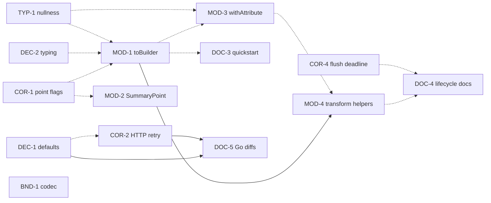

# API Hardening Backlog

Scope: pre-1.0 public API hardening — boundary, ergonomics, correctness, type hygiene, docs.

This backlog captures the pre-1.0 public-API hardening work for `otlp4j`. Each item is discrete and actionable, names the concrete files it touches, and lists its dependencies. The goal is to tighten the public boundary and stabilize ergonomics **before wider use**, without changing the high-level shape of the API (immutable records, signal-specific sinks, explicit transports, small pipeline DSL).

## Legend

- **Priority** — `P0` (before any release), `P1` (before wider use), `P2` (nice-to-have / before 1.0), `1.0` (decide before 1.0), `defer` (only when a real user need appears).
- **Effort** — `S` (≤½ day), `M` (~1–2 days), `L` (≥3 days or design-heavy).
- **Kind** — `decision` (produce a short written ADR-style note), `code`, `docs`, `policy`.
- **Status** — `todo` for all items at creation.

## Item Catalog

### Decisions / spikes (gate downstream work)

These produce a short written decision. They block documentation and policy items that must describe a final answer, so they are sequenced first even though several can be decided in parallel.

#### DEC-1 — Decide secure-vs-plaintext and retry defaults · `P1` · `S` · decision

Decide whether `otlp4j` keeps local-friendly defaults (plaintext `localhost:4317/4318`, receiver `0.0.0.0`, `RetryPolicy.none()`) or moves toward Go's secure-by-default plus default retry. Record the rationale either way. This is a policy call, not necessarily a code change.

- **Output:** a decision note in `docs/` (or an ADR) stating the chosen defaults and why.
- **Acceptance:** decision written; follow-up code/doc items (DOC-5, optionally COR-2 framing) reference it.

#### DEC-2 — Decide final ID / flag / timestamp typing · `1.0` · `M` · decision

Decide whether trace/span IDs stay lowercase-hex `String`, flags stay `long`, and timestamps stay `long` epoch-nanos, or move to `TraceId`/`SpanId`/`TraceFlags`/`Timestamp` value types. These types permeate the model, so the directional call should be made **before** investing in new builder surface (MOD-1). If "keep strings/longs," document that as final and keep validation strict.

- **Acceptance:** decision written; MOD-1 builders adopt the chosen ID/flag types.

### Boundary & stability

#### BND-1 — Resolve the codec public/internal contradiction · `P0` · `M` · code + docs

`otlp4j-codec/src/main/java/module-info.java` exports `dev.nthings.otlp4j.codec` **unqualified**, while `README.md`, `docs/public-api.md`, and `otlp4j-codec/pom.xml` call it internal. Pick one:

- **(a) Keep internal:** restore a qualified `exports … to` the transports (resolve the reactor build-order problem the current comment cites — e.g. module ordering or a non-published module), so it is no longer visible on the module path.
- **(b) Make supported:** add a deliberate codec facade, drop the "internal" language everywhere.
- **Files:** `otlp4j-codec/src/main/java/module-info.java`, `otlp4j-codec/pom.xml`, `docs/public-api.md`, `README.md`.
- **Acceptance:** export behavior and all prose agree; no module describes codec as internal while exporting it unqualified.

### Documentation accuracy & UX

#### DOC-1 — Correct stale / contradictory comments · `P0` · `S` · docs

- `otlp4j-api/.../receiver/Receiver.java`: remove "future `OtlpHttpReceiver`" (it exists).
- `otlp4j-samples/src/test/java/.../OtlpE2eDemoTest.java`: remove the service-provider-interface "runtime transport discovery" claim (architecture docs state there is no provider discovery).
- **Acceptance:** no comment claims a not-yet-existing HTTP receiver or SPI-based transport discovery.

#### DOC-2 — Fix "SDK" positioning wording + dead reference · `P1` · `S` · docs

- Parent `pom.xml` description "A modular OpenTelemetry Protocol SDK" → "OTLP gateway/pipeline library" (or similar), to match the README's non-instrumentation-SDK positioning.
- `docs/project.md`: stop describing the project as a "Java SDK."
- Parent `pom.xml`: fix or remove the `docs/TEST_STRATEGY.md` reference (file does not exist) — either add the doc or drop the pointer.
- **Acceptance:** Maven metadata and `docs/project.md` no longer say "SDK"; no live reference to a missing `TEST_STRATEGY.md`.

#### DOC-3 — "Start Here" quickstart in `docs/public-api.md` · `P1` · `S` · docs

Add a compact, task-oriented index with three code paths: receive-and-print, receive-transform-export, and construct-and-export a batch. Keep the existing reference content.

- **Soft depends on:** MOD-1 (so copy-modify can appear in the transform example).

#### DOC-4 — Lifecycle cheat sheet + ownership examples · `P2` · `M` · docs

Add a one-page lifecycle cheat sheet plus runnable examples for count sinks (showing why `owns(...)` is needed), batcher auto-ownership, fan-out, and exporter-facet ownership.

- **Soft depends on:** COR-4 (flush-deadline semantics), MOD-4 (transform examples).

#### DOC-5 — Document deliberate default & env-var differences vs Go · `P1` · `S` · docs

Surface, near every `fromEnvironment()` example, that `otlp4j` (a) defaults to plaintext plus no retry, (b) reads only general `OTEL_EXPORTER_OTLP_*` (no signal-specific overrides), and (c) the HTTP retry timeout behavior chosen in COR-2. Frame each as deliberate.

- **Depends on:** DEC-1, COR-2.

#### DOC-6 — Thread-safety & nullness summary for lifecycle classes · `P2` · `S` · docs

Summarize concurrency/thread-safety for receivers, exporters, batchers, and subscriptions, and the nullness contract, in public docs.

- **Soft depends on:** TYP-1.

### Model ergonomics

#### MOD-1 — Add `toBuilder()` to builder-backed model records · `P1` · `M` · code

Add `toBuilder()` to `Span`, `Metric`, `LogRecord`, `NumberPoint`, `HistogramPoint`, `ExponentialHistogramPoint`, and `Exemplar` (all already have `builder()` but no copy path). This is the single highest-value change for custom transforms.

- **Files:** the listed records under `otlp4j-model/src/main/java/dev/nthings/otlp4j/model/`.
- **Soft depends on:** COR-1 (so point-record `toBuilder().build()` inherits flags validation), DEC-2 (final ID/flag types), TYP-1 (new code born `@NullMarked`).
- **Acceptance:** each record round-trips `x.toBuilder().build().equals(x)`; flags re-validated.

#### MOD-2 — Builder / copy helper for `SummaryPoint` · `P1` · `S` · code

`SummaryPoint` has only an `of(...)` factory. Add a builder (and `toBuilder()`) consistent with the other points so it is copy-modifiable.

- **Soft depends on:** COR-1.

#### MOD-3 — `withAttribute(...)` convenience on `Resource`, `InstrumentationScope`, `Attributes` · `P2` · `S` · code

Resource/scope enrichment is common; `Attributes.toBuilder().put(...).build()` works but is verbose. Add a shorter path.

- **Soft depends on:** MOD-1, TYP-1.

#### MOD-4 — Transform helper layer (map spans / log records / resources) · `P1`–`P2` · `L` · code

Custom transforms must reconstruct `ResourceSpans`/`ScopeSpans`/`ResourceMetrics`/… by hand. Add a narrow helper family — e.g. `Transforms.mapSpans(...)`, `Transforms.mapLogRecords(...)`, `Transforms.mapResources(...)` (and/or `TraceData.mapSpans(...)`) — that hides nested wrapper reconstruction. Keep it narrow: no query language.

- **Files:** `otlp4j-api/.../processor/Transforms.java`, traversal helpers on `TraceData`/`MetricsData`/`LogsData`.
- **Depends on:** MOD-1 (hard — map closures rebuild records via `toBuilder()`); soft on MOD-3.
- **Acceptance:** a span/log/resource rewrite transform can be written without naming any `Resource*`/`Scope*` wrapper type; covered by an example (feeds DOC-3/DOC-4).

### Correctness & validation

#### COR-1 — Validate metric data-point `flags` at construction · `P1` · `S` · code

`Span` and `LogRecord` normalize flags via `Ids.flags(...)`, but `NumberPoint`, `HistogramPoint`, `ExponentialHistogramPoint`, and `SummaryPoint` accept any `long`; `MetricsMapper` later casts to `int`, so out-of-range values silently wrap at the transport boundary. Route point flags through the same validation in the canonical constructor.

- **Files:** the four point records; cross-check `otlp4j-codec/.../MetricsMapper`.
- **Acceptance:** out-of-range flags rejected at construction with a clear message; no silent wrap.

#### COR-2 — HTTP retry timeout: shared deadline or documented per-attempt · `P1` · `M` · code/docs

`HttpOtlpClient` applies `config.timeout()` per `HttpRequest` and sleeps between retries, so total export wall-clock can exceed the configured timeout. Either adopt one shared deadline across the retry loop (Go-like) or document the per-attempt semantics explicitly.

- **Files:** `otlp4j-transport-http/.../HttpOtlpClient` (and config docs).
- **Acceptance:** behavior matches the documented contract; if shared-deadline, a test asserts total time ≤ timeout (+ slack). Feeds DOC-5.

#### COR-3 — `FanOut` should catch `Throwable` (or narrow its doc) · `P1` · `S` · code/docs

`FanOut` catches only `RuntimeException`, but the Javadoc says a throwing peer is captured as a per-peer `Rejected`. A synchronous `Error` escapes and starves later peers. Either catch `Throwable` (consistent with `Pipeline.peek` fire-and-forget) or change the doc to say only runtime exceptions are captured.

- **Files:** `otlp4j-api/src/main/java/dev/nthings/otlp4j/pipeline/FanOut.java`.
- **Acceptance:** code and Javadoc agree; a test covers a throwing peer not blocking siblings.

#### COR-4 — Share the flush deadline across owned resources · `P1` · `S` · code/docs

`PipelineSubscription.shutdown(...)` uses one shared deadline, but `forceFlush(...)` passes the full timeout to each owned resource sequentially, so total flush can exceed the requested timeout with multiple buffered resources. Share the deadline across `forceFlush`, or document the difference.

- **Files:** `Pipeline.PipelineSubscription` in `otlp4j-api/src/main/java/dev/nthings/otlp4j/pipeline/Pipeline.java`.
- **Acceptance:** flush honors a single deadline, or the divergence is documented in `docs/public-api.md`.

### Type-system hygiene

#### TYP-1 — Systematic nullness (`@NullMarked` + targeted `@Nullable`) · `P1` · `M` · code

Only a few files are `@NullMarked` (`Metric`, `LogRecord`, `Exemplar`, `ThrowingConsumer`, `Transform`) while `org.jspecify` is exposed transitively. Apply package-level `@NullMarked` across public model/api packages and annotate intentional nullables (e.g. `ServerConfig.serverExecutor`, null-defaulting builder fields). Do this **before** adding new public API so new surface is born annotated.

- **Acceptance:** every exported package is `@NullMarked`; intentional nullables carry `@Nullable`.

#### TYP-2 — Use `Sink<? super T>` consistently · `P2` · `S` · code

`Pipeline.Stage.to(Sink<T>)`, `Pipeline.Branch.fanOut(Sink<T>)`, and `FanOut.of(...)` are invariant in `T`, while `Source.subscribe` and `BatchingProcessor.Builder.downstream` use `? super T`. Make the contravariant bound consistent so generic sinks compose.

- **Acceptance:** the three sites accept `Sink<? super T>`; existing call sites still compile.

#### TYP-3 — Steer users toward `retryableRejected` / `permanentRejected` · `P2` · `S` · docs/code

The generic `ConsumeResult.rejected(String)` is implicitly retryable and easy to pick by accident. Promote `retryableRejected(...)` / `permanentRejected(...)` in examples and the method-list Javadoc, and make retry semantics prominent. (Optionally `@Deprecated`-soft or rename in docs only.)

- **Acceptance:** examples and Javadoc lead with the intent-revealing factories.

## Dependency Matrix

Hard = must land first. Soft = recommended-before (avoids rework) but not blocking.

| ID    | Title                             | Pri   | Eff | Hard deps    | Soft deps           | Wave |
| ----- | --------------------------------- | ----- | --- | ------------ | ------------------- | ---- |
| DEC-1 | Secure/retry defaults decision    | P1    | S   | —            | —                   | 0    |
| DEC-2 | ID/flag/timestamp typing decision | 1.0   | M   | —            | —                   | 0    |
| BND-1 | Codec boundary                    | P0    | M   | —            | —                   | 0    |
| DOC-1 | Stale/contradictory comments      | P0    | S   | —            | —                   | 0    |
| DOC-2 | "SDK" wording + dead ref          | P1    | S   | —            | —                   | 0    |
| COR-1 | Metric-point flags validation     | P1    | S   | —            | —                   | 1    |
| COR-2 | HTTP retry deadline               | P1    | M   | —            | DEC-1               | 1    |
| COR-3 | FanOut catch `Throwable`          | P1    | S   | —            | —                   | 1    |
| COR-4 | Shared flush deadline             | P1    | S   | —            | —                   | 1    |
| TYP-1 | Systematic nullness               | P1    | M   | —            | —                   | 1    |
| TYP-2 | `? super T` variance              | P2    | S   | —            | —                   | 1    |
| MOD-1 | `toBuilder()` on records          | P1    | M   | —            | COR-1, DEC-2, TYP-1 | 2    |
| MOD-2 | `SummaryPoint` builder            | P1    | S   | —            | COR-1               | 2    |
| MOD-3 | `withAttribute(...)` helpers      | P2    | S   | —            | MOD-1, TYP-1        | 2    |
| MOD-4 | Transform map helpers             | P1–P2 | L   | MOD-1        | MOD-3               | 3    |
| TYP-3 | `ConsumeResult` steering          | P2    | S   | —            | —                   | 3    |
| DOC-3 | "Start Here" quickstart           | P1    | S   | —            | MOD-1               | 4    |
| DOC-4 | Lifecycle cheat sheet             | P2    | M   | —            | COR-4, MOD-4        | 4    |
| DOC-5 | Go default/env-var diffs          | P1    | S   | DEC-1, COR-2 | —                   | 4    |
| DOC-6 | Thread-safety/nullness docs       | P2    | S   | —            | TYP-1               | 4    |

### Dependency graph

Solid arrows are hard dependencies (prerequisite → dependent); dashed arrows are soft (recommended-before).

`MOD-1` is the central unblock: it gates the transform-helper layer (MOD-4) and the copy-modify examples in the docs. Every other hard chain is shallow (depth ≤ 2); `DEC-1 → COR-2 → DOC-5` is the only other multi-step path.

## Suggested Execution Order

Waves group items that can proceed in parallel; later waves consume earlier outputs. Within a wave, order is flexible.

**Wave 0 — Decisions & cheap factual fixes (unblocks everything; mostly `S`).** Land DEC-1, DEC-2 (write the decisions), BND-1 (P0 codec boundary), DOC-1 (P0 stale comments), DOC-2 ("SDK" wording). These are low-risk and remove the documentation/boundary contradictions that most damage perceived stability.

**Wave 1 — Low-risk correctness & type hygiene (independent; do `TYP-1` before any new API).** COR-1, COR-2, COR-3, COR-4, TYP-1, TYP-2. Establishing the `@NullMarked` baseline (TYP-1) and the point-flags validation (COR-1) here means the Wave-2 builder surface is born correct.

**Wave 2 — Model ergonomics.** MOD-1 (the keystone), MOD-2, MOD-3. Built on COR-1 plus TYP-1.

**Wave 3 — Composability helpers.** MOD-4 (needs MOD-1) and TYP-3. This is where reusable redaction/enrichment transforms become easy.

**Wave 4 — Docs UX & policy.** DOC-5 (needs DEC-1 plus COR-2), DOC-3, DOC-4, DOC-6. Documentation now describes final defaults, the new copy/transform ergonomics.
