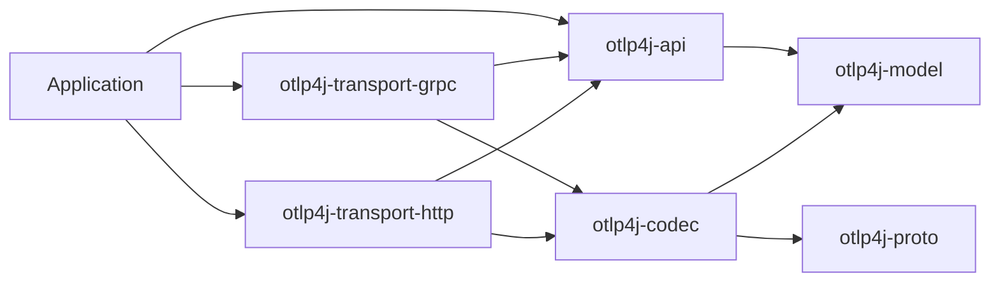

# Architecture

otlp4j isolates the wire protocol from its public Java API. Applications exchange immutable domain records with signal-specific sinks; only the transport maps those records to generated OTLP messages.

## Module boundaries

The dependency graph is deliberately one-way:

`otlp4j-api` re-exports the model module but does not read the codec, transport, or proto modules. `otlp4j-proto` qualified-exports its generated packages only to `otlp4j-codec` and the two transports, and each transport exports just its public `transport.grpc`/`transport.http` package.

There is no provider-discovery step. An application picks a transport by instantiating the concrete entry point — `OtlpGrpcExporter`/`OtlpGrpcReceiver` (gRPC + Netty) or `OtlpHttpExporter`/`OtlpHttpReceiver` (JDK `java.net.http`/`jdk.httpserver`). Each is built directly on an `OtlpClient`/`OtlpServer` implementation from the `spi` package and shares the `otlp4j-codec` proto↔domain mappers. The two transport modules are independent, so an HTTP-only deployment never pulls in gRPC or Netty, and a gRPC-only one never pulls in the HTTP server.

## Request path

Each signal follows the same asynchronous request and acknowledgement path:

The transport converts a completed `ConsumeResult` into the signal's OTLP partial-success response. A thrown exception or exceptionally completed stage becomes a gRPC failure. The tap is outside this acknowledgement path unless its buffer strategy is explicitly set to `BLOCK`.

An unattached source returns `Accepted`. A source has one attachment slot; fan-out must therefore be part of the attached consumer graph.

## Pipeline semantics

`Pipeline.from(source)` composes synchronous batch operations before attaching one terminal consumer:

- `transform` rewrites one batch without changing its signal type.
- `filter` acknowledges a batch as accepted without forwarding it when the predicate returns false.
- `peek` invokes a best-effort observer (a plain `java.util.function.Consumer`) and ignores its result. It does not wait for an asynchronous observer or handle its later failure.
- `owns` registers an `AutoCloseable` (e.g. the exporter behind a count sink's downstream, or any resource reachable only behind a lambda) for the subscription to drain on shutdown and flush on `forceFlush`.
- `branch` builds a concurrent `FanOut`; `join` attaches it.
- `to` attaches one terminal consumer.

Fan-out sends the same immutable batch reference to every peer. If any peer rejects the batch, the merged result is rejected. Otherwise, partial rejection uses the largest rejected-item count rather than a sum because all peers saw the same input.

Pipeline subscriptions drain lifecycle resources registered explicitly via `Stage.owns(...)` or `Stage.to(terminal, owner)`, plus any terminal or fan-out peer that implements `AutoCloseable` (such as a directly attached `BatchingProcessor`). Exporter signal facets are plain sinks; register the exporter itself for shutdown.

## Processing and routing

Built-in stateless transforms filter spans or log records and add resource attributes to any signal. Empty resource and scope groups are removed by the record-level filters.

`BatchingProcessor<T>` buffers complete domain batches, then merges their top-level resource groups via signal-specific [BatchMergers]. It flushes when the queue reaches `maxBatchSize`, on the periodic `maxBatchAge` timer, or through `forceFlush`/`shutdown`. Profiles batching is available only through the experimental `forProfilesUnsafe()` factory.

`Connectors.spanCount` converts a trace batch into the `otlp4j.connector.span.count` metric; `Connectors.logRecordCount` similarly emits `otlp4j.connector.log.record.count`. These count sinks consume their input signal and send the derived `MetricsData` to a supplied `MetricSink`; they do not forward the original batch. Each flush carries a real per-series delta window — `[previous flush, now)`, monotonic even under concurrent calls or a backward wall-clock step. A `FailurePolicy` (default `BEST_EFFORT`) decides how a downstream metric failure maps back onto the input: `BEST_EFFORT` accepts the input and logs the failure, while `FAIL` propagates a downstream `Partial`/`Rejected` as a `Rejected` on the input result.

## Receiver tap

`TelemetryTap` exposes one JDK `Flow.Publisher` per signal and an `all()` publisher of sealed `Telemetry` envelopes. Every subscriber has its own bounded queue and virtual-thread dispatcher. New subscriptions use the tap options active when they subscribe; changing options does not resize existing subscription buffers.

The default buffer holds 256 batches and drops the oldest on overflow. Other strategies drop the newest, block the publishing request thread, or terminate the overflowing subscription with an error. `droppedCount()` is shared across the receiver's tap publishers.

## Transport implementation

The two transport modules — `otlp4j-transport-grpc` and `otlp4j-transport-http` — each implement the `OtlpClient`/`OtlpServer` SPI and share the `otlp4j-codec` proto↔domain mappers and the same `ConsumeResult`→response encoding (`SignalResponses`). Both map a whole-batch `Rejected` to a delivery error rather than `rejected_*=0`: no cause is transient/retryable (gRPC `UNAVAILABLE` / HTTP `503`), a cause is permanent (gRPC `INTERNAL` / HTTP `500`).

**gRPC.** The client uses blocking gRPC stubs on a virtual-thread-per-task executor and applies the configured deadline to each export. The server exposes trace, metric, log, and experimental profile collector services. The client selects channel credentials from `Tls` (plaintext, JVM default trust, or a custom certificate bundle), attaches the configured headers to every call, requests gzip compression when configured, and maps `RetryPolicy` onto gRPC's native retry via the channel's default service config. The server, built on `NettyServerBuilder`, selects its credentials from `Tls` (`Disabled` for plaintext, `Custom` for a server certificate and key; `SystemTrust` is rejected, having no server certificate) and binds the configured `bindHost`: a wildcard host (empty, `0.0.0.0`, or `::`) binds every interface, while any other host binds that specific interface, so `127.0.0.1` yields a loopback-only receiver. It also applies the receiver-hardening limits from `ServerConfig` — a decoded-request size cap, an optional per-connection concurrency cap, a handshake deadline, and an optional bounded executor. Compression is decode-only on the server: gzip request bodies decode via gRPC's default decoder and there is no server compression knob.

**HTTP.** The client (`java.net.http.HttpClient`) POSTs each signal's serialized `Export*ServiceRequest` to its standard path (`/v1/traces`, `/v1/metrics`, `/v1/logs`, `/v1development/profiles`) as `application/x-protobuf`, on a virtual-thread-per-task executor with the deadline applied per request. The scheme follows `Tls` (`http`/`https`), with a JDK `SSLContext` built from the same PEM material the gRPC transport consumes (`PemSsl`); headers attach to every request, `Compression.GZIP` gzips the body with `Content-Encoding: gzip`, and `RetryPolicy` drives an explicit exponential-backoff retry loop over retryable statuses (408/429/502/503/504) and IO failures. The server (`com.sun.net.httpserver`) registers a handler per signal path, transparently inflates gzip request bodies, enforces the decoded-size cap (→ `413`), and rejects a bad method (`405`) or malformed body (`400`); without a configured executor it runs handlers on a virtual-thread-per-task executor. `Tls.Custom` serves over `HttpsServer`; `Tls.SystemTrust` is rejected as for gRPC. `maxConcurrentCallsPerConnection` has no HTTP equivalent and is not applied.

An alternate transport can vary any of this without changing the application API.

## Model fidelity

Traces, logs, and the metric aggregations round-trip between domain and proto representations, including metric exemplars: each number, histogram, and exponential-histogram point carries a `List<Exemplar>` mapped in both directions. A `Metric` whose wire `data` was unset round-trips as the non-null `Metric.NoData` form rather than `null`, so callers switch over `Metric.data()` and handle `NoData` instead of null-checking. Profiles round-trip losslessly through opaque passthrough rather than a fully modeled payload — each `Profile` carries the serialized proto `Profile` bytes and the batch carries the serialized `ProfilesDictionary`, so samples, locations, mappings, string tables, and the original payload re-emits byte-for-byte while only the resource/scope wrapper is modeled. The remaining gap is stable profiles support, because the bundled schema is OpenTelemetry `v1development`.

Trace and span IDs are hex strings in the domain model. Encoding malformed hex fails at the transport boundary. Span flags use a Java `long`; OTLP encoding keeps the wire-format unsigned 32-bit value.
