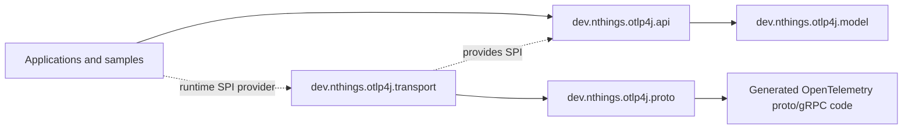

# Architecture

otlp4j is split around one rule: user code should speak typed OTLP domain objects, not generated Protobuf or gRPC classes. JPMS module boundaries enforce that rule.

## Module boundaries

Use this as the reference diagram for ownership and runtime wiring:

`otlp4j-api` has no dependency on `otlp4j-proto`, `otlp4j-transport`, or `io.grpc`. The API knows only the SPI interfaces:

- `OtlpServerProvider` creates an `OtlpServer` for `OtlpReceiver`.
- `OtlpClientProvider` creates an `OtlpClient` for `OtlpGrpcExporter`.

`otlp4j-transport` provides both services through JPMS `provides` clauses and `META-INF/services`, so the same runtime wiring works on the module path and class path.

## Data flow

```mermaid
flowchart LR
    client["OTLP client"] --> server["Transport gRPC server"]
    server --> mapperIn["proto to domain mapper"]
    mapperIn --> receiver["OtlpReceiver consumer"]
    receiver --> consumer["TelemetryConsumer"]
    consumer --> pipeline["Processor / BatchProcessor / Connector"]
    pipeline --> exporter["OtlpGrpcExporter"]
    exporter --> mapperOut["domain to proto mapper"]
    mapperOut --> grpcClient["Transport gRPC client"]
    grpcClient --> endpoint["OTLP endpoint"]
```

### Receive

`OtlpReceiver` resolves an `OtlpServerProvider` with `ServiceLoader`. The transport starts a plaintext gRPC server, maps incoming proto requests into `TraceData`, `MetricsData`, `LogsData`, or `ProfilesData`, and passes the domain batch into the configured consumer.

Throwing from a handler or pipeline component is treated as a transport failure rather than a partial-success response. Returning `ExportResult` maps back to OTLP `partial_success`.

### Process and connect

Every pipeline component is built on `TelemetryConsumer`:

- `Processor` wraps a downstream consumer and usually forwards the same signal after transforming it.
- `BatchProcessor` buffers each signal independently and flushes synchronously on threshold, explicit `flush()`, or `close()`.
- `Connector` consumes one signal and may emit another signal into a downstream consumer.
- `Exporter` is a terminal consumer with a lifecycle.

The current built-in processors are deliberately small:

- `Processors.filterSpans(...)`
- `Processors.filterLogRecords(...)`
- `Processors.setResourceAttribute(...)`

`CountConnector` is the current connector example. It consumes traces or logs and emits delta-sum metrics named `otlp4j.connector.span.count` and `otlp4j.connector.log.record.count`.

### Export

`OtlpGrpcExporter` resolves an `OtlpClientProvider` with `ServiceLoader`. The transport maps domain telemetry to proto, sends a blocking plaintext gRPC request to the configured host and port, and maps the response back to `ExportResult`. Defaults are `localhost:4317` and a 10 second deadline.

## Generated code isolation

`otlp4j-proto` contains generated OpenTelemetry definitions and exports its packages only to `dev.nthings.otlp4j.transport`. That prevents generated message types from leaking into public API signatures, samples, or downstream application code.

`otlp4j-transport` exports no packages. It is reachable only through the SPI and is free to change internal mapper and gRPC implementation details without changing the API module.

## Runtime and packaging notes

- Add `otlp4j-api` for compile-time use.
- Add `otlp4j-transport` at runtime if you want the built-in OTLP/gRPC transport.
- The transport currently uses plaintext `InsecureChannelCredentials` and `InsecureServerCredentials`.
- `ServiceLoader.findFirst()` selects the provider. Avoid multiple client or server providers on the runtime path unless you intentionally control provider ordering.
- The samples module has optional `native` and `jlink` profiles. The `jlink` profile links only the pure API side and keeps the automatic-module transport stack outside the linked closure.

## Current tradeoffs

- Profiles support targets OpenTelemetry `v1development` and keeps only stable top-level profile metadata in the domain model.
- Metric exemplars are not represented.
- Trace/span IDs are strings in the model and are encoded as hex at the transport boundary. Malformed hex currently fails during proto encoding.
- Span flags are modeled as `long`, but OTLP carries unsigned 32-bit flags; values above that range are truncated during encode.
