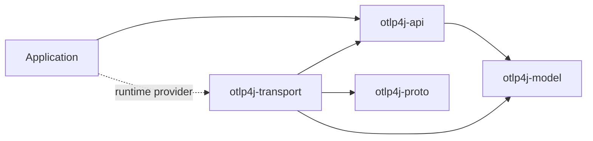
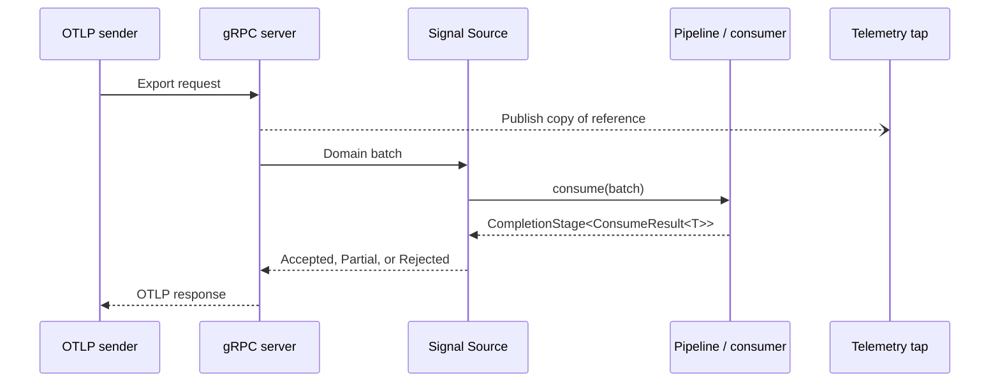

# Architecture

otlp4j isolates the wire protocol from its public Java API. Applications exchange immutable domain records with signal-specific consumers; only the transport maps those records to generated OTLP messages.

## Module boundaries

The dependency graph is deliberately one-way:

`otlp4j-api` re-exports the model module but does not read the transport or proto modules. `otlp4j-proto` qualified-exports generated packages only to `otlp4j-transport`, and the transport exports no packages.

The API discovers the first `OtlpServerProvider` or `OtlpClientProvider` available through `ServiceLoader`. The bundled transport registers both JPMS `provides` declarations and class-path service files.

## Request path

Each signal follows the same asynchronous request and acknowledgement path:

The transport converts a completed `ConsumeResult` into the signal's OTLP partial-success response. A thrown exception or exceptionally completed stage becomes a gRPC failure. The tap is outside this acknowledgement path unless its buffer strategy is explicitly set to `BLOCK`.

An unattached source returns `Accepted`. A source has one attachment slot; fan-out must therefore be part of the attached consumer graph.

## Pipeline semantics

`Pipeline.from(source)` composes synchronous batch operations before attaching one terminal consumer:

- `transform` rewrites one batch without changing its signal type.
- `filter` acknowledges a batch as accepted without forwarding it when the predicate returns false.
- `peek` invokes a best-effort observer (a plain `java.util.function.Consumer`) and ignores its result. It does not wait for an asynchronous observer or handle its later failure.
- `branch` builds a concurrent `FanOut`; `join` attaches it.
- `to` attaches one terminal consumer.

Fan-out sends the same immutable batch reference to every peer. If any peer rejects the batch, the merged result is rejected. Otherwise, partial rejection uses the largest rejected-item count rather than a sum because all peers saw the same input.

The returned `Subscription` owns the source attachment. It also closes terminal objects that directly implement `AutoCloseable`, including a directly attached `BatchingProcessor`. Method-reference facets such as `exporter.traces()` and downstream resources hidden inside connectors are not discoverable as lifecycle resources; their owners must be closed separately.

## Processing and routing

Built-in stateless transforms filter spans or log records and add resource attributes to any signal. Empty resource and scope groups are removed by the record-level filters.

`BatchingProcessor<T>` buffers complete domain batches, then merges their top-level resource groups. It flushes when the queue reaches `maxBatchSize`, on the periodic `maxBatchAge` timer, or through `forceFlush`/`shutdown`. Defaults are 512 queued batches per flush, a five-second timer, a queue capacity of 2048, and `DROP_NEWEST` overflow handling.

`SpanCountConnector` converts a trace batch into the `otlp4j.connector.span.count` metric. `LogRecordCountConnector` similarly emits `otlp4j.connector.log.record.count`. Connectors consume their input signal and send the derived `MetricsData` to a supplied `MetricConsumer`; they do not forward the original batch.

## Receiver tap

`TelemetryTap` exposes one JDK `Flow.Publisher` per signal and an `all()` publisher of sealed `Telemetry` envelopes. Every subscriber has its own bounded queue and virtual-thread dispatcher. New subscriptions use the tap options active when they subscribe; changing options does not resize existing subscription buffers.

The default buffer holds 256 batches and drops the oldest on overflow. Other strategies drop the newest, block the publishing request thread, or terminate the overflowing subscription with an error. `droppedCount()` is shared across the receiver's tap publishers.

## Transport implementation

The built-in client uses blocking gRPC stubs on a virtual-thread-per-task executor and applies the configured deadline to each export. The server exposes trace, metric, log, and experimental profile collector services.

The bundled provider honours the full SPI configuration surface. The client selects channel credentials from `Tls` (plaintext, JVM default trust, or a custom certificate bundle), attaches the configured headers to every call, requests gzip compression when configured, and maps `RetryPolicy` onto gRPC's native retry via the channel's default service config. The server selects its credentials from `Tls` (`Disabled` for plaintext, `Custom` for a server certificate and key; `SystemTrust` is rejected, having no server certificate). The one field still unused is the server's `bindHost`: gRPC binds its default address. Alternate providers can vary any of this without changing the application API.

## Model fidelity

Traces, logs, and the principal metric aggregations round-trip between domain and proto representations. The intentional gaps are:

- metric exemplars;
- detailed profile sample, location, mapping, and dictionary data;
- stable profiles support, because the bundled schema is OpenTelemetry `v1development`.

Trace and span IDs are hex strings in the domain model. Encoding malformed hex fails at the transport boundary. Span flags use a Java `long`; OTLP encoding keeps the wire-format unsigned 32-bit value.
