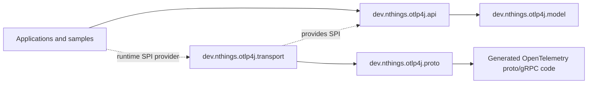

# Architecture

otlp4j is split around one rule: user code should speak typed OTLP domain objects, not generated Protobuf or gRPC classes. JPMS module boundaries enforce that rule, and the public SDK standard mirrors the OpenTelemetry Collector shape: receivers expose signal sources, pipelines transform and route those signals, connectors derive new signals, and exporters terminate the flow.

## Module boundaries

Use this as the reference diagram for ownership and runtime wiring:



`otlp4j-api` has no dependency on `otlp4j-proto`, `otlp4j-transport`, or `io.grpc`. The API knows only the SPI interfaces:

- `OtlpServerProvider` creates an `OtlpServer` for `OtlpGrpcReceiver`.
- `OtlpClientProvider` creates an `OtlpClient` for `OtlpGrpcExporter`.

`otlp4j-transport` provides both services through JPMS `provides` clauses and `META-INF/services`, so the same runtime wiring works on the module path and class path. The transport module exports no packages.

## Public SDK standard

The current SDK standard is per-signal and asynchronous:

```text
Source<T> -> Consumer<T>.consume(T) -> CompletionStage<ConsumeResult<T>>
```

The four signal-specific SAMs are:

- `TraceConsumer`
- `MetricConsumer`
- `LogConsumer`
- `ProfileConsumer`

There is no unified `TelemetryConsumer` contract. A consumer only receives the signal type it declares, which prevents accidental cross-signal wiring and makes lambdas natural in Java and Kotlin.

`ConsumeResult<T>` carries OTLP partial-success semantics for one signal:

- `Accepted<T>` means the full batch was accepted.
- `Partial<T>` reports a positive rejected-item count and message.
- `Rejected<T>` reports whole-batch rejection.

The type parameter matters: traces, metrics, logs, and profiles have independent OTLP rejection counters and must not be merged as one aggregate number.

## Data flow

```mermaid
flowchart LR
    client["OTLP client"] --> server["Transport gRPC server"]
    server --> mapperIn["proto to domain mapper"]
    mapperIn --> receiver["OtlpGrpcReceiver"]
    receiver --> source["Source<T>"]
    source --> pipeline["Pipeline transforms / filters / fan-out"]
    pipeline --> terminal{"terminal"}
    terminal --> exporter["OtlpGrpcExporter facet"]
    terminal --> connector["Connector<I,O>"]
    connector --> emitted["Derived signal"]
    emitted --> exporter
    exporter --> mapperOut["domain to proto mapper"]
    mapperOut --> grpcClient["Transport gRPC client"]
    grpcClient --> endpoint["OTLP endpoint"]
    receiver -. side channel .-> tap["TelemetryTap Flow.Publisher"]
```



### Receive

`OtlpGrpcReceiver` resolves an `OtlpServerProvider` with `ServiceLoader`. The transport starts a plaintext gRPC server, maps incoming proto requests into `TraceData`, `MetricsData`, `LogsData`, or `ProfilesData`, and dispatches the batch to the signal's `Source<T>`.

A receiver exposes one source per signal:

- `receiver.traces()`
- `receiver.metrics()`
- `receiver.logs()`
- `receiver.profiles()`

Each source accepts one consumer attachment. If several peers need the same batch, use `FanOut<T>` directly or `Pipeline.from(source).branch().fanOut(...).join()`. A source with no attached consumer returns `ConsumeResult.acceptedStage()`.

Builder sugar such as `onTraces(...)` attaches a single consumer during receiver construction. Richer graphs should attach through the source API.

Thrown exceptions and failed completion stages are transport failures. Completed `ConsumeResult` values map to OTLP `partial_success` responses.

### Pipeline

`Pipeline.from(source)` opens a typed graph builder over one signal. The builder supports:

- `transform(Transform<T>)` for pure 1-to-1 batch rewrites.
- `filter(Predicate<T>)` to drop whole batches by returning accepted without forwarding.
- `tap(Consumer<T>)` for best-effort side observers whose errors do not affect the main path.
- `branch().fanOut(...).join()` for explicit multi-consumer fan-out.
- `to(Consumer<T>)` for a single terminal consumer.

`FanOut<T>` delivers the same batch to all peers concurrently and aggregates results with `ConsumeResult.fanOutMerge(...)`. Rejection counts use worst-case fan-out semantics, not sums, because every peer saw the same original batch.

`Subscription` owns the graph wiring. `shutdown(Duration)` detaches the source and drains lifecycle-aware leaves. `forceFlush(Duration)` forwards flush requests to leaves that implement `Pipeline.Flushable`.

### Process

Transforms are the current stateless processor standard. Built-in transforms live in `Transforms`:

- `keepSpansWhere(...)`
- `keepLogRecordsWhere(...)`
- `setTraceResourceAttribute(...)`
- `setMetricsResourceAttribute(...)`
- `setLogsResourceAttribute(...)`
- `setProfilesResourceAttribute(...)`

`BatchingProcessor<T>` is the stateful processor. It is asynchronous, queue-backed, and timer-triggered. It flushes on `maxBatchSize`, `maxBatchAge`, `forceFlush(Duration)`, or `shutdown(Duration)`. Queue overflow is controlled by `DropPolicy`: `DROP_OLDEST`, `DROP_NEWEST`, `BLOCK`, or `ERROR`.

Batching is per signal. `BatchingProcessor.forTraces()`, `forMetrics()`, `forLogs()`, and `forProfiles()` each know how to merge only their own signal shape.

### Connect

`Connector<I,O>` consumes one signal and emits another. Unlike a transform, it is not required to forward the input signal and does not need a 1-to-1 relationship between input and output batches.

The built-in connectors derive count metrics:

- `SpanCountConnector` consumes `TraceData` and emits `otlp4j.connector.span.count`.
- `LogRecordCountConnector` consumes `LogsData` and emits `otlp4j.connector.log.record.count`.

Both require a downstream `MetricConsumer`.

### Export

`OtlpGrpcExporter` resolves an `OtlpClientProvider` with `ServiceLoader`. One exporter instance owns the transport client and exposes per-signal consumer facets:

- `exporter.traces()`
- `exporter.metrics()`
- `exporter.logs()`
- `exporter.profiles()`

The built-in transport maps domain telemetry to proto and exports asynchronously on virtual threads while using blocking gRPC stubs internally. Defaults are `localhost:4317` and a 10 second deadline.

### Live tap

Every receiver has a `TelemetryTap`:

- `tap.traces()`
- `tap.metrics()`
- `tap.logs()`
- `tap.profiles()`
- `tap.all()`

The publishers are JDK `Flow.Publisher` streams. Tap subscribers are independent of the in-pipeline path; lagging tap subscribers use `TapOptions` and `BackpressureStrategy` for their own buffers. The default is `DROP_OLDEST` with a 256-element buffer. `droppedCount()` reports tap-side drops.

## Generated code isolation

`otlp4j-proto` contains generated OpenTelemetry definitions and exports its packages only to `dev.nthings.otlp4j.transport`. That prevents generated message types from leaking into public API signatures, samples, or downstream application code.

`otlp4j-transport` exports no packages. It is reachable only through the SPI and is free to change internal mapper and gRPC implementation details without changing the API module.

## Runtime and packaging notes

- Add `otlp4j-api` for compile-time use.
- Add `otlp4j-transport` at runtime if you want the built-in OTLP/gRPC transport.
- `ServiceLoader.findFirst()` selects the provider used by the current receiver/exporter helpers. Avoid multiple client or server providers on the runtime path unless you intentionally control provider ordering.
- `ClientTransportConfig` carries client endpoint, timeout, TLS, headers, compression, and retry shape. `ServerTransportConfig` carries bind host, port, and TLS shape. The current gRPC transport honours plaintext operation; non-disabled TLS variants currently fall back to plaintext.
- The samples module has optional `native` and `jlink` profiles. The `jlink` profile links only the pure API side and keeps the automatic-module transport stack outside the linked closure.

## Current tradeoffs

- Profiles support targets OpenTelemetry `v1development` and keeps stable top-level profile metadata in the domain model.
- Metric exemplars are not represented.
- Trace/span IDs are strings in the model and are encoded as hex at the transport boundary. Malformed hex fails during proto encoding.
- Span flags are modeled as `long`, but OTLP carries unsigned 32-bit flags; values above that range are truncated during encode.
- The built-in gRPC transport has SPI-level configuration for future production transport features, but the implementation is still plaintext.
