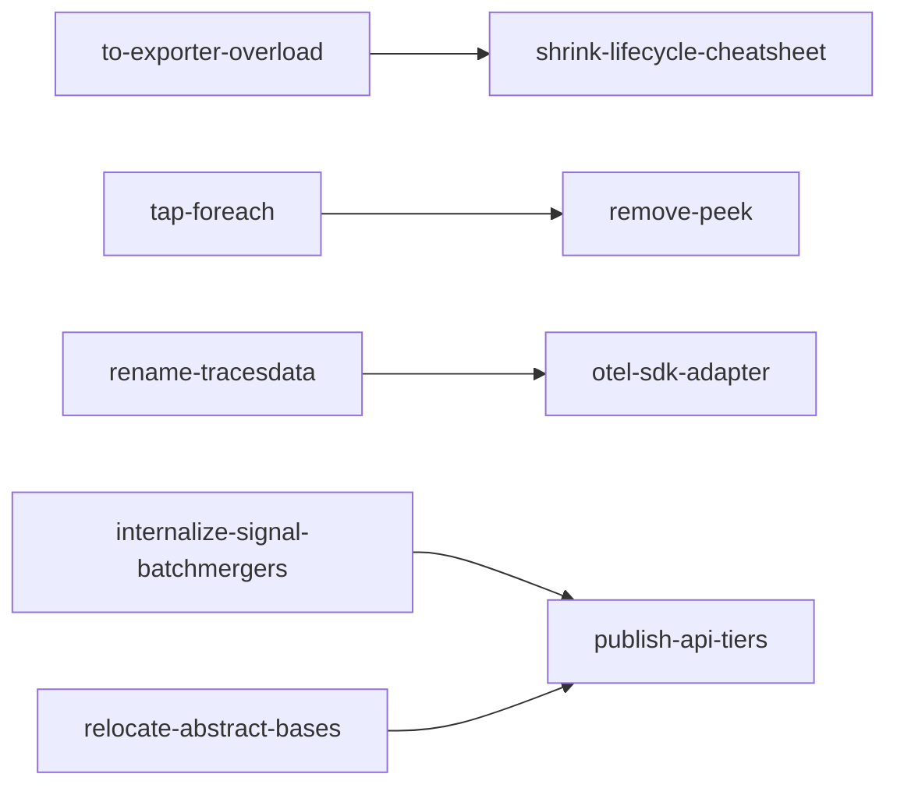
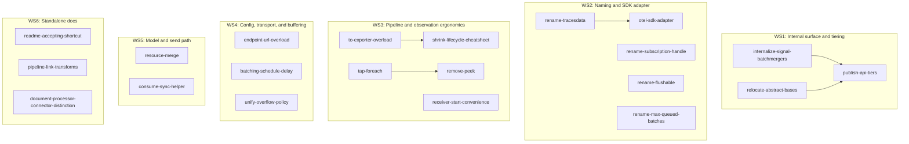

# otlp4j Backlog

This backlog is grouped for migration to GitHub issues. Each issue has a stable slug, GitHub-ready title, labels, dependencies, context, and checkbox acceptance criteria.

## Issue Template

Use this shape when creating GitHub issues from this file:

```yaml
slug: issue-slug
github_title: "Short imperative title"
type: feature | refactor | improvement
phase: 1 | 2 | 3
workstream: ws-name
labels:
  - label
depends_on:
  - other-issue-slug
```

Issue body:

- Context: why this exists.
- Acceptance criteria: copy the checkbox list.
- Dependency notes: hard blockers only. Soft coordination belongs in the rollout notes.

## Label Legend

- `api-surface`: adds, removes, renames, or changes visibility of public symbols.
- `breaking`: binary- or source-incompatible change.
- Component labels name affected areas: `core`, `model`, `pipeline`, `processor`, `receiver`, `exporter`, `transport`, `spi`, `docs`, `lifecycle`, `sdk-alignment`, `ergonomics`, `internal`, `new-module`.

## Phase 1: Quick Wins

Dependency-free items that either do not break users or are small enough to land early while the API is still soft.

### `internalize-signal-batchmergers`

```yaml
slug: internalize-signal-batchmergers
github_title: "Internalize Signal and BatchMergers"
type: refactor
phase: 1
workstream: ws1-internal-surface-and-tiering
labels: [breaking, api-surface, internal, processor]
depends_on: []
```

Context: `processor.Signal` and `processor.BatchMergers` are public in the exported `processor` package, but they are implementation details. They appear in autocomplete and javadoc and risk becoming accidental API.

Acceptance criteria:

- [ ] Move both types to `dev.nthings.otlp4j.processor.internal`, keeping them accessible inside `otlp4j-api` without exporting the package.
- [ ] Do not expose the internal package in `module-info.java`.
- [ ] Keep `BatchMergers` reachable only through internal `Signal.merge`.
- [ ] Relocate or update existing `SignalTest` / `BatchMergersTest` so they still compile.
- [ ] Remove both types from `docs/public-api.md` concept inventory.
- [ ] Build and existing tests pass.

### `endpoint-url-overload`

```yaml
slug: endpoint-url-overload
github_title: "Add URL endpoint overloads to exporter builders"
type: feature
phase: 1
workstream: ws4-config-transport-buffering
labels: [api-surface, transport, exporter, sdk-alignment]
depends_on: []
```

Context: exporter builders expose `endpoint(String host, int port)`, while OpenTelemetry SDK and `OTEL_EXPORTER_OTLP_ENDPOINT` use URL-shaped endpoints.

Acceptance criteria:

- [ ] `OtlpGrpcExporter.builder().endpoint("https://collector:4317")` compiles and configures the exporter correctly.
- [ ] HTTP exporter has the same `endpoint(String)` shape.
- [ ] `endpoint(URI)` overloads exist alongside the `String` overloads.
- [ ] Reuse `config.OtlpEnv.applyEndpoint(...)` parsing behavior rather than adding a parallel parser.
- [ ] Preserve the existing `endpoint(host, port)` form.
- [ ] HTTP honors parsed path; gRPC documents that path is ignored.
- [ ] `https` implies TLS.
- [ ] Tests cover TLS inference, default ports, IPv6 bracket stripping, HTTP path parsing, and invalid URL errors.

### `batching-schedule-delay`

```yaml
slug: batching-schedule-delay
github_title: "Add scheduleDelay to BatchingProcessor"
type: feature
phase: 1
workstream: ws4-config-transport-buffering
labels: [api-surface, processor, sdk-alignment]
depends_on: []
```

Context: `BatchDrainEngine` hardcodes a one-second flush cadence. The `scheduler` setting chooses the executor, not the interval.

Acceptance criteria:

- [ ] `BatchingProcessor` builder exposes `scheduleDelay(Duration)`.
- [ ] Default stays one second.
- [ ] `BatchDrainEngine` uses the configured interval.
- [ ] Reject non-positive durations.
- [ ] Do not add an `exporterTimeout` knob.
- [ ] Docs describe the new knob.
- [ ] Tests verify a custom interval triggers flushes at that cadence.

### `readme-accepting-shortcut`

```yaml
slug: readme-accepting-shortcut
github_title: "Show accepting shortcut in the README hello example"
type: improvement
phase: 1
workstream: ws6-standalone-docs
labels: [docs, ergonomics]
depends_on: []
```

Context: the hello example returns `ConsumeResult.acceptedStage()`, making that boilerplate look mandatory.

Acceptance criteria:

- [ ] README hello example demonstrates the `TraceSink.accepting(...)` shortcut.
- [ ] Text clarifies that explicit `acceptedStage()` remains available but is not required for the common callback shape.

### `pipeline-link-transforms`

```yaml
slug: pipeline-link-transforms
github_title: "Cross-link Transforms from pipeline javadoc"
type: improvement
phase: 1
workstream: ws6-standalone-docs
labels: [docs, pipeline, processor]
depends_on: []
```

Context: users building a `Pipeline` naturally look in the `pipeline` package, but ready-made transforms live in `processor.Transforms`.

Acceptance criteria:

- [ ] `pipeline` package javadoc references `processor.Transforms`.
- [ ] Optionally cross-link from README or `docs/public-api.md`.

### `tap-foreach`

```yaml
slug: tap-foreach
github_title: "Add tap forEach convenience methods"
type: feature
phase: 1
workstream: ws3-pipeline-and-observation
labels: [api-surface, receiver, tap, ergonomics]
depends_on: []
```

Context: observing the tap currently requires a handwritten `Flow.Subscriber` for the common "just inspect batches" use case.

Acceptance criteria:

- [ ] Add a `forEach(Consumer)`-style API for traces, metrics, logs, and profiles.
- [ ] Prefer an additive route that does not change existing `TelemetryTap.traces()` / `metrics()` / `logs()` / `profiles()` return types.
- [ ] If an existing return type is widened in a binary-incompatible way, add the `breaking` label to this issue before migration.
- [ ] The helper subscribes a demand-aware subscriber and honors `TapOptions` backpressure behavior.
- [ ] The helper returns a handle that can be cancelled.
- [ ] Tests cover delivery and cancellation.

### `consume-sync-helper`

```yaml
slug: consume-sync-helper
github_title: "Add a synchronous consume helper"
type: feature
phase: 1
workstream: ws5-model-and-send-path
labels: [api-surface, ergonomics, core, exporter]
depends_on: []
```

Context: the construct-and-send workflow has to end in `.toCompletableFuture().join()` today.

Acceptance criteria:

- [ ] Add a blocking helper such as `Sink.consumeSync(batch, Duration)` or a static `join(CompletionStage<ConsumeResult<T>>, Duration)`.
- [ ] Return `ConsumeResult`.
- [ ] Honor a timeout or deadline.
- [ ] Surface failures without requiring callers to use `.toCompletableFuture()` directly.
- [ ] Keep the async `CompletionStage` API unchanged.
- [ ] Update README or `docs/public-api.md` construct-and-send examples to use the helper.

### `receiver-start-convenience`

```yaml
slug: receiver-start-convenience
github_title: "Decide and smooth receiver start ergonomics"
type: improvement
phase: 1
workstream: ws3-pipeline-and-observation
labels: [api-surface, receiver, ergonomics, lifecycle]
depends_on: []
```

Context: the report calls out `build().start()` as easy to forget, and notes the asymmetry that exporter `to(...)` connects while receiver `on(...)` factories do not start.

Acceptance criteria:

- [ ] Decide whether the API should add a started factory, an explicit `buildStarted()` / `start()` convenience, or docs-only guidance.
- [ ] Preserve the existing `to()` exporter and `on()` receiver mnemonic unless the decision explicitly replaces it.
- [ ] If an API convenience is added, tests cover started and not-started receiver states.
- [ ] If the decision is docs-only, document the rationale in README or `docs/public-api.md`.

## Phase 2: Pre-Release Breaking Changes

Source-breaking changes worth making before a wider public release.

### `unify-overflow-policy`

```yaml
slug: unify-overflow-policy
github_title: "Collapse DropPolicy and BackpressureStrategy into OverflowPolicy"
type: refactor
phase: 2
workstream: ws4-config-transport-buffering
labels: [breaking, api-surface, core, processor, receiver]
depends_on: []
```

Context: `processor.DropPolicy` and `receiver.BackpressureStrategy` have identical constants and model the same overflow choice.

Acceptance criteria:

- [ ] Add `core.OverflowPolicy { DROP_OLDEST, DROP_NEWEST, BLOCK, ERROR }`.
- [ ] Change `BatchingProcessor` from `dropPolicy(...)` to `overflow(OverflowPolicy)`.
- [ ] Change `TapOptions` to use `OverflowPolicy`.
- [ ] Remove `DropPolicy` and `BackpressureStrategy`.
- [ ] Docs preserve context-specific behavior for `BLOCK`, `ERROR`, and `DROP_NEWEST` in the batcher vs tap.
- [ ] Tests and samples compile with the unified enum.

### `rename-tracesdata`

```yaml
slug: rename-tracesdata
github_title: "Rename TraceData to TracesData"
type: refactor
phase: 2
workstream: ws2-naming-renames
labels: [breaking, api-surface, model, naming, sdk-alignment]
depends_on: []
```

Context: OTLP uses `TracesData`, and otlp4j already uses plural `MetricsData`, `LogsData`, and `ProfilesData`.

Acceptance criteria:

- [ ] Rename `model.TraceData` to `TracesData`.
- [ ] Update every referencing module: api, model, codec, transport-grpc, transport-http, testing, samples, and tests.
- [ ] `TracesData.of(...)` works.
- [ ] `Source<TracesData>`, the trace sink alias, and `traces()` references compile.
- [ ] Keep `spans()` and `spanCount()` accessors.
- [ ] Docs are updated.

### `rename-subscription-handle`

```yaml
slug: rename-subscription-handle
github_title: "Rename core Subscription to PipelineHandle"
type: refactor
phase: 2
workstream: ws2-naming-renames
labels: [breaking, api-surface, core, naming, pipeline]
depends_on: []
```

Context: `core.Subscription` collides with `java.util.concurrent.Flow.Subscription`, which users encounter through the tap.

Acceptance criteria:

- [ ] Rename `core.Subscription` to `PipelineHandle` unless a better final name is chosen.
- [ ] Update `Pipeline.to`, `Pipeline.join`, `Source.subscribe`, SPI/internal references, and samples.
- [ ] Avoid examples that import both the otlp4j handle and `Flow.Subscription` under colliding names.
- [ ] Docs are updated.

### `rename-flushable`

```yaml
slug: rename-flushable
github_title: "Resolve core Flushable naming clash"
type: refactor
phase: 2
workstream: ws2-naming-renames
labels: [breaking, api-surface, core, naming]
depends_on: []
```

Context: `core.Flushable` shadows `java.io.Flushable` but has a different signature.

Acceptance criteria:

- [ ] Rename `core.Flushable` to an unambiguous name such as `ForceFlushable` or `Flushing`.
- [ ] Do not merge it into `Drainable`.
- [ ] Update `PipelineLifecycle` `instanceof` checks.
- [ ] Update implementors such as `BatchingProcessor` and `AbstractOtlpExporter`.
- [ ] `Receiver` remains intentionally not force-flushable.
- [ ] Docs and javadocs are updated.

### `to-exporter-overload`

```yaml
slug: to-exporter-overload
github_title: "Add pipeline overloads that accept exporter objects"
type: feature
phase: 2
workstream: ws3-pipeline-and-observation
labels: [api-surface, lifecycle, pipeline, exporter, ergonomics]
depends_on: []
```

Context: exporter facets are plain sinks, so users must remember `owns(exporter)` or `to(facet, exporter)` or they leak the channel.

Acceptance criteria:

- [ ] Add `Pipeline.from(src).to(exporter)` or equivalent signal-aware overload that resolves the signal facet and registers exporter lifecycle.
- [ ] Add `branch().fanOut(exporter)` or equivalent fan-out shape.
- [ ] Retain existing `to(facet, owner)` and `owns(...)` APIs.
- [ ] Keep facets as plain sinks; do not make bare facets `AutoCloseable`.
- [ ] Account for type erasure by threading a signal discriminator through `Source` to `Stage`, or document the equivalent facet-resolution mechanism.
- [ ] Add a test proving the exporter is registered and shut down exactly once through the new overload.
- [ ] If the public `Source` interface changes, add the `breaking` label before migration.

### `shrink-lifecycle-cheatsheet`

```yaml
slug: shrink-lifecycle-cheatsheet
github_title: "Shrink lifecycle cheat sheet after exporter overloads"
type: improvement
phase: 2
workstream: ws3-pipeline-and-observation
labels: [docs, lifecycle]
depends_on:
  - to-exporter-overload
```

Context: once exporter lifecycle travels with the exporter object in common wiring, repeated documentation warnings can be reduced.

Acceptance criteria:

- [ ] Remove or reduce repeated "register the exporter with `owns(...)`" caveats where the new overload is the recommended path.
- [ ] Update README, `docs/public-api.md`, and `docs/architecture.md` to show the new simplest wiring path.
- [ ] Keep any remaining lifecycle caveats limited to advanced or legacy wiring.

### `rename-max-queued-batches`

```yaml
slug: rename-max-queued-batches
github_title: "Rename maxBatchSize on BatchingProcessor"
type: refactor
phase: 2
workstream: ws2-naming-renames
labels: [breaking, api-surface, processor, naming, sdk-alignment]
depends_on: []
```

Context: `maxBatchSize` counts queued batches, not telemetry items, so it reads like the SDK's per-item `setMaxExportBatchSize` while meaning something else.

Acceptance criteria:

- [ ] Rename the builder method and field to `maxQueuedBatches`, or choose `flushThreshold` if that better matches the implementation.
- [ ] Preserve `queueCapacity` as the hard queue cap.
- [ ] Align `docs/public-api.md` wording around queued batches.
- [ ] Tests and samples compile.

### `relocate-abstract-bases`

```yaml
slug: relocate-abstract-bases
github_title: "Relocate abstract transport bases as internal SPI"
type: refactor
phase: 2
workstream: ws1-internal-surface-and-tiering
labels: [breaking, api-surface, spi, internal, transport]
depends_on: []
```

Context: `AbstractOtlpExporter` and `AbstractOtlpReceiver` are implementation details of bundled transports, not supported third-party extension points.

Acceptance criteria:

- [ ] Move both bases to `dev.nthings.otlp4j.spi.internal`.
- [ ] Qualified-export the package only to `dev.nthings.otlp4j.transport.grpc` and `dev.nthings.otlp4j.transport.http`.
- [ ] Do not generally export the internal SPI package.
- [ ] Bundled transport classes compile against the new location.
- [ ] API module tests or test fixtures using these bases are updated.
- [ ] Docs classify them as internal SPI or omit them from public API inventory.

## Phase 3: Follow-On Features and Deeper Docs

Items that depend on earlier API cleanup or are broader design/documentation follow-ups.

### `resource-merge`

```yaml
slug: resource-merge
github_title: "Add Resource.merge and settle enrichment helper scope"
type: feature
phase: 3
workstream: ws5-model-and-send-path
labels: [api-surface, model, sdk-alignment]
depends_on: []
```

Context: `Resource` has per-key `withAttribute`, but the SDK exposes `merge`; the action plan also calls out enrichment ergonomics.

Acceptance criteria:

- [ ] Add `Resource.merge(Resource)`.
- [ ] Document precedence semantics.
- [ ] Tests cover precedence, `EMPTY`, and empty-side cases.
- [ ] Evaluate whether a small enrichment helper is still needed after `merge`.
- [ ] If existing `Transforms.*Resource` helpers already cover enrichment, record that decision in docs and do not add duplicate transforms.

### `remove-peek`

```yaml
slug: remove-peek
github_title: "Remove Pipeline.peek in favor of tap observation"
type: refactor
phase: 3
workstream: ws3-pipeline-and-observation
labels: [breaking, api-surface, pipeline]
depends_on:
  - tap-foreach
```

Context: maintainer decision: remove `peek`; with `tap().<signal>().forEach(...)`, the tap becomes the single observation mechanism.

Acceptance criteria:

- [ ] Remove `Pipeline.peek(Consumer)`.
- [ ] Update tests and samples that use `peek`.
- [ ] Document that migration is not semantically one-to-one because `peek` was in-path and fire-and-forget while tap is demand-aware side-channel.
- [ ] Observation docs point to the tap.

### `document-processor-connector-distinction`

```yaml
slug: document-processor-connector-distinction
github_title: "Document processor versus connector semantics"
type: improvement
phase: 3
workstream: ws6-standalone-docs
labels: [docs, processor, connector]
depends_on: []
```

Context: maintainer decision: keep the package split. The docs should make the distinction intentional.

Acceptance criteria:

- [ ] `docs/architecture.md` or `docs/public-api.md` states that processors are in-pipeline, single-signal transforms or buffers.
- [ ] The same docs state that connectors perform cross-signal derivation.
- [ ] Include guidance for when to use each package.
- [ ] No package merge is performed.

### `publish-api-tiers`

```yaml
slug: publish-api-tiers
github_title: "Publish the 0.1 API tiers"
type: improvement
phase: 3
workstream: ws1-internal-surface-and-tiering
labels: [docs, api-surface]
depends_on:
  - internalize-signal-batchmergers
  - relocate-abstract-bases
```

Context: users need to know which public types are the frozen 0.1 surface, which are advanced, and which are internal or extension-only.

Acceptance criteria:

- [ ] README or `docs/public-api.md` presents Tier 1, Tier 2, Tier 3, and Internal categories.
- [ ] Tier 1 identifies the stable 80 percent path.
- [ ] `Signal`, `BatchMergers`, and relocated abstract bases are excluded from public tiers.
- [ ] Tier 3 reflects the final SPI/internal placement.

### `otel-sdk-adapter`

```yaml
slug: otel-sdk-adapter
github_title: "Build optional otlp4j OpenTelemetry SDK adapter"
type: feature
phase: 3
workstream: ws2-naming-renames
labels: [api-surface, new-module, sdk-alignment, exporter]
depends_on:
  - rename-tracesdata
```

Context: the core should keep `CompletionStage` and `ConsumeResult`; a thin optional adapter should bridge to OpenTelemetry SDK types.

Acceptance criteria:

- [ ] Add an optional `otlp4j-otel-sdk` module.
- [ ] Provide an SDK `SpanExporter` adapter that forwards to a `TraceSink`.
- [ ] Convert `Collection<SpanData>` to `TracesData`.
- [ ] Convert `CompletionStage<ConsumeResult<TracesData>>` to `CompletableResultCode`.
- [ ] Test against OpenTelemetry SDK types.
- [ ] Document the module as optional.
- [ ] Keep core modules free of `CompletableResultCode`.

## Dependency and Workstream Graphs

### Hard Dependencies



### Workstreams


