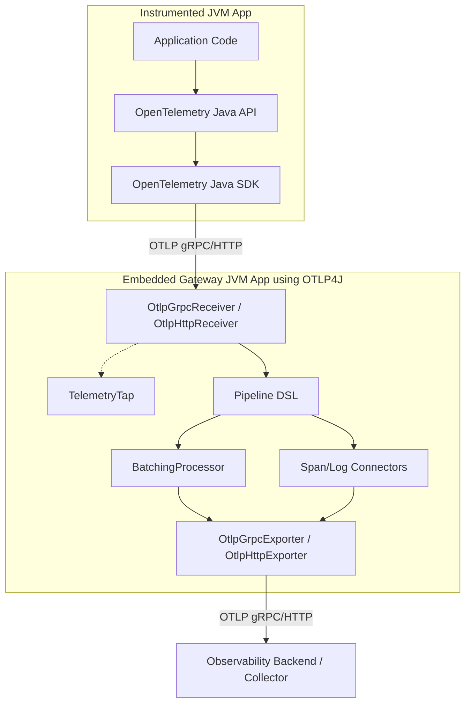

# OTLP4J vs OpenTelemetry Java SDK

## Executive Summary

OTLP4J and the OpenTelemetry Java SDK are **complementary**, not substitutes.

OTLP4J is an embedded OTLP gateway and data-plane library: it receives, processes, observes, routes, and forwards telemetry batches that already exist as OTLP. The OpenTelemetry Java SDK is an application telemetry SDK: it manages telemetry produced by instrumentation APIs — span lifecycle, metric recording, log emission, sampling, aggregation, and export.

The best way to leverage upstream is likely an optional integration module, not replacing OTLP4J core. Instrument with the SDK; route emitted OTLP through an embedded OTLP4J gateway when you need local processing, fan-out, or forwarding control.

## Architectural Positioning

The fundamental difference is where each project sits on the telemetry data path:



| Dimension | OTLP4J | OpenTelemetry Java SDK |
| --- | --- | --- |
| **Primary role** | OTLP data-plane gateway: receive, process, route, forward telemetry batches | Application instrumentation: generate telemetry via tracer/meter/logger APIs |
| **Directionality** | Bidirectional (receiver + exporter) | Unidirectional (export only) |
| **Input model** | External OTLP/gRPC or OTLP/HTTP requests | `Tracer`, `Meter`, logger bridge, profile SDK data |
| **Output model** | OTLP exporters for traces, metrics, logs, profiles | Exporters for SDK `SpanData`, `MetricData`, `LogRecordData`, alpha `ProfileData` |
| **Receiver support** | Yes — gRPC and HTTP OTLP receivers | No OTLP receiver/server abstraction |
| **Processing model** | Batch pipeline: transform, filter, fan-out, tap, batch, count connectors | Span processors, log processors, metric readers, views, samplers |
| **Data model** | Immutable OTLP-oriented records preserving resource/scope grouping | SDK snapshot data optimized around instrumentation lifecycle |
| **Protobuf exposure** | Proto types encapsulated in `otlp4j-proto`, qualified-exported only to codec/transport modules | Proto types visible at the exporter layer |
| **JPMS modularity** | Full JPMS for shipped library modules, qualified exports, no split packages | No JPMS module descriptors |
| **Transport architecture** | Public SPI (`OtlpClient`/`OtlpServer`); HTTP uses JDK built-ins; gRPC uses gRPC + Netty | Internal sender abstraction; HTTP depends on OkHttp by default (JDK sender opt-in) |
| **Protocol focus** | OTLP-first (traces, metrics, logs, profiles) | Agnostic core with plugin exporters (OTLP, Prometheus, Zipkin, logging) |
| **Configuration** | Small OTLP exporter/env config surface (`fromEnvironment()` on exporters) | Mature autoconfigure, SPI, env/sysprop config, resource providers |
| **Profiles** | Experimental OTLP profile receive/process/export with opaque passthrough | Alpha profiles SDK/exporter artifacts |
| **Ecosystem** | Focused JVM OTLP data-plane library (`0.1.0-SNAPSHOT`, experimental) | Official SDK, Java agent, Spring starter, contrib exporters/processors |

### Convergence

Both projects understand OpenTelemetry concepts: resources, instrumentation scopes, traces, metrics, logs, OTLP/gRPC, OTLP/HTTP protobuf, TLS, headers, compression, retry, flush, and shutdown. Both use asynchronous export patterns.

The divergence is architectural: OTLP4J works **after** telemetry already exists as OTLP; the SDK works **before** that — while telemetry is being created, sampled, aggregated, limited, processed, and exported.

---

## Unique Capabilities of OTLP4J

Things you can do with OTLP4J that the OpenTelemetry Java SDK does not directly provide:

### OTLP Ingestion (Receiver / Server)

The SDK can only export telemetry; it has no receiver component. OTLP4J's `OtlpGrpcReceiver` and `OtlpHttpReceiver` listen on a port (defaults 4317 and 4318) and accept OTLP push requests from any OTLP-compatible client — instrumented apps, agents, or external collectors.

**Use cases:** embedded telemetry gateways, local relays, test OTLP receivers, and custom JVM-based aggregators without deploying a standalone OpenTelemetry Collector.

### Declarative Pipeline DSL and Concurrent Routing

OTLP4J provides a fluent pipeline for transforming, filtering, and branching data streams in-memory:

```java
Pipeline.from(receiver.traces())
    .transform(Transforms.keepSpansWhere(s -> s.kind() == Span.Kind.SERVER))
    .filter(t -> !t.spans().isEmpty())
    .to(FanOut.of(exporterA.traces(), exporterB.traces()));
```

**Use cases:** multi-destination routing, data redaction/scrubbing, tenant routing, and dynamic telemetry splitting.

### Live Stream Observation (TelemetryTap)

Every receiver exposes independent `Flow.Publisher` streams with a configurable overflow policy (`DROP_OLDEST`, `DROP_NEWEST`, `BLOCK`, `FAIL`). Observation is independent of the acknowledgement path by default. **`OverflowPolicy.BLOCK` can block the receiver dispatch thread** and should be used with care in production.

**Use cases:** real-time telemetry inspection, test assertions, and local anomaly detectors without degrading the main forwarding path.

### Receiver-Side Partial Success and Rejection

Pipeline sinks return `ConsumeResult` (`Accepted`, `Partial`, `Rejected`), which the receiver maps to OTLP partial-success or rejection responses. The SDK's exporter architecture does not expose this receive-side semantics.

### Signal-to-Signal Connectors

`Connectors.spanCount()` and `Connectors.logRecordCount()` derive metrics from trace/log batches (`otlp4j.connector.span.count`, `otlp4j.connector.log.record.count`). The SDK's exporter architecture does not support cross-signal derivation at the batch level.

**Use case:** generate span-rate or log-rate metrics locally without configuring tail-sampling or server-side span metrics on the backend.

### Proto-Free Domain Model

Application code never touches protobuf types. Domain records are pure Java records in `dev.nthings.otlp4j.model`, with selective sealed types for exhaustive pattern matching. Generated proto classes remain inside `otlp4j-proto` and are qualified-exported only to codec and transport modules.

### JDK HTTP Transport Path

`otlp4j-transport-http` uses only JDK built-in APIs (`java.net.http`, `jdk.httpserver`) for HTTP I/O — no OkHttp or Netty in the HTTP transport path. The module still depends on protobuf and slf4j; an HTTP-only deployment never pulls in gRPC or Netty.

### Dual Transports with Consistent Contract

gRPC and HTTP transports share codec mappers and map `ConsumeResult` to OTLP responses through the same encoding layer (`SignalResponses`). Underlying stacks differ (gRPC status codes vs HTTP status codes, Netty vs JDK server), but retry is configured through Resilience4j `RetryConfig` and executed through the same shared adapter.

### Graceful Lifecycle Management

Pipeline subscriptions drain `AutoCloseable` terminals and fan-out peers — including exporter facets, which carry their exporter's lifecycle, and count connectors, which cascade shutdown to their downstream metric sink — within a shared shutdown deadline, and provide cancellation-aware teardown; `Stage.owns(...)` covers a resource the pipeline can't see, such as an exporter behind a bare lambda terminal or fronted by a batching processor. `BatchingProcessor` and other buffered stages honor `forceFlush`/`shutdown`. Bare exporters hold no queue — `forceFlush()` matters when a batching processor or similar buffer sits in the pipeline.

### Configurable Batching with Overflow Policies

`BatchingProcessor` offers `DROP_OLDEST`, `DROP_NEWEST`, `BLOCK`, and `FAIL` overflow policies. The SDK's `BatchSpanProcessor` has a single fixed overflow behavior (block + drop when full).

### Experimental Profiles Opaque Passthrough

OTLP4J supports experimental OTLP profiles (`v1development`), parsing resource/scope wrappers and passing profile payloads as opaque bytes. Payloads round-trip losslessly when raw profile bytes and compatible dictionaries are preserved through processing. **`BatchingProcessor.forProfilesUnsafe()` requires compatible dictionaries across merged batches.**

---

## Unique Capabilities of OpenTelemetry Java SDK

Things the SDK provides that OTLP4J cannot replicate (nor intends to):

### Instrumentation API and Auto-Instrumentation

The SDK implements the OpenTelemetry API (`Tracer`, `Meter`, `Logger`). It is backed by the `opentelemetry-java-instrumentation` Java Agent, which injects bytecode to automatically capture data from JDBC, HTTP, gRPC, messaging, and other frameworks. OTLP4J's `Span.Builder` constructs OTLP batch records, not live instrumentation.

### Execution Context and Propagation

Tracks active telemetry scopes across asynchronous thread boundaries using `Context` and thread-local state. Manages header injection/extraction (W3C TraceContext, Baggage, B3, Jaeger, OT Trace) to link distributed services. OTLP4J has no context propagation.

### Span Processors and Sampling

`BatchSpanProcessor`, `SimpleSpanProcessor`, custom `SpanProcessor` implementations, and the full sampler hierarchy (`AlwaysOn`, `TraceIdRatioBased`, `ParentBased`, `JaegerRemoteSampler`, custom `Sampler` SPI). OTLP4J has no sampling or span lifecycle hooks.

### Metrics Aggregation and State Engine

Stateful metrics engine that accumulates raw measurements, computes bucket distributions, manages aggregations, and handles temporality (Cumulative vs Delta). The `View` API allows renaming metrics, overriding aggregation, filtering attributes, and setting cardinality limits. OTLP4J forwards pre-aggregated OTLP metrics as-is.

### Exemplar Filter

Configurable exemplar capture (`ALWAYS_OFF`, `ALWAYS_ON`, `TRACE_BASED`). OTLP4J's `Exemplar` is a passive model type for existing exemplary data.

### Autoconfiguration SPI

The `sdk-extensions/autoconfigure` module provides zero-config setup from environment variables and SPI-loaded `ResourceProvider`, `ConfigurableSpanExporterProvider`, `ConfigurableSamplerProvider`, and related providers. OTLP4J's `fromEnvironment()` is opt-in and covers exporter config only.

### Resource Detectors

Built-in resource detectors for container, host, process, AWS ECS/Beanstalk/EC2, GCP GCE/GKE. OTLP4J's `Resource` is a passive record with no detection.

### Non-OTLP Exporters

Prometheus HTTP server, logging exporters, OTLP JSON logging exporters, Zipkin, and contrib exporters. OTLP4J only exports OTLP/binary protobuf.

### Mature Ecosystem

Official SDK releases on Maven Central, extensive documentation, Java agent, Spring starter integration, semantic conventions, and broad community adoption. OTLP4J is experimental `0.1.0-SNAPSHOT`.

### Production Hardening

Configurable `SpanLimits`, metric cardinality limits (default 2000 per instrument), log limits, and other guardrails. OTLP4J's model has no such enforcement — it trusts the data it receives.

Some SDK extension points are not meaningfully replicable in OTLP4J without changing its purpose: `Sampler`, `SpanProcessor#onStart`, metric `View`, `MetricReader`, `TextMapPropagator`, and autoconfigured resource providers operate before or during telemetry creation, while OTLP4J operates on already-created OTLP batches.

---

## How They Fit Together

Using the OpenTelemetry Java SDK and OTLP4J together creates a unified observability model within JVM environments:

### Embedded JVM Gateway (Local Collector Proxy)

Applications are instrumented with the OpenTelemetry Java SDK. Instead of exporting over the network to an external collector, they export OTLP locally to an embedded OTLP4J receiver in the same process or a sidecar. Local telemetry can be buffered, enriched, duplicated, or forked before leaving the boundary — shielding the application from backend network latency or collector downtime.

### In-JVM Metrics Extraction (Connectors)

Flow trace data through an OTLP4J pipeline, run it through `Connectors.spanCount(metricSink)`, and generate custom rate metrics locally in the gateway.

### Multi-Tenant Telemetry Router

A centralized routing service using OTLP4J reads tenant routing definitions and forwards telemetry to different vendor backends based on resource attributes.

### Live Inspection and Test Receivers

Stand up an OTLP4J receiver with a `TelemetryTap` or simple `onTraces` handler to observe incoming batches during development or integration testing.
