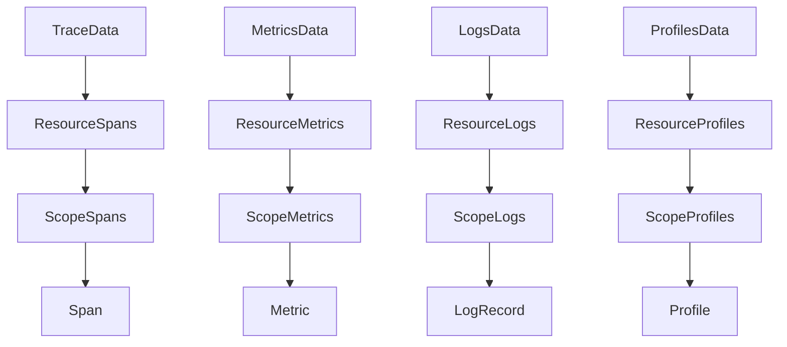

# Public API

The public API is the surface application authors should use. It lives in two modules:

- `dev.nthings.otlp4j.model`: pure OTLP domain records.
- `dev.nthings.otlp4j.api`: pipeline, receiver, exporter, processor, connector, and transport SPI APIs.

`dev.nthings.otlp4j.transport` is not a public programming surface. Add it at runtime when you want the built-in OTLP/gRPC transport.

## Domain model

The model module contains immutable records that mirror OTLP's resource/scope/signal hierarchy:



Flattening helpers are available for common consumers:

- `TraceData.spans()`
- `MetricsData.metrics()`
- `LogsData.logRecords()`
- `ProfilesData.profiles()`

Attributes are represented by `Attributes` and the sealed `AttributeValue` family. Trace and span identifiers are lowercase hex strings in normal round trips, not byte arrays.

Prefer builders where they exist (`Span.builder()`, `Metric.builder()`, `Attributes.builder()`), because several canonical record constructors intentionally stay close to the OTLP wire shape.

## Consumer contract

`Consumer<T>` is the central pipeline contract:

```java
CompletionStage<ConsumeResult<T>> consume(T batch);
```

Use the per-signal SAMs in application code:

- `TraceConsumer` consumes `TraceData`.
- `MetricConsumer` consumes `MetricsData`.
- `LogConsumer` consumes `LogsData`.
- `ProfileConsumer` consumes `ProfilesData`.

Example:

```java
TraceConsumer countSpans = traces -> {
    System.out.println("spans=" + traces.spans().size());
    return ConsumeResult.acceptedStage();
};
```

`ConsumeResult<T>` represents the OTLP acknowledgement for one signal:

- `accepted()` accepts the full batch.
- `partial(rejectedItems, message)` accepts part of the batch.
- `rejected(message)` reports whole-batch rejection.
- `fanOutMerge(...)` combines peer results that all saw the same batch.
- `sequentialMerge(...)` combines results from sequential stages of the same signal.

Throw an exception or complete the returned stage exceptionally when you want a transport-level failure instead of an OTLP partial-success response.

## Receivers

`OtlpGrpcReceiver` is the built-in OTLP/gRPC ingest endpoint:

```java
var receiver = OtlpGrpcReceiver.builder()
        .endpoint("0.0.0.0", 4317)
        .onTraces(traces -> {
            System.out.println("received " + traces.spans().size() + " spans");
            return ConsumeResult.acceptedStage();
        })
        .build()
        .start();
```

Use `ephemeralPort()` in tests or demos, then read the selected port with `port()`.

A receiver exposes one typed source per signal:

```java
Source<TraceData> traces = receiver.traces();
Source<MetricsData> metrics = receiver.metrics();
Source<LogsData> logs = receiver.logs();
Source<ProfilesData> profiles = receiver.profiles();
```

Attach directly for simple cases:

```java
var subscription = receiver.traces().consume(countSpans);
```

Each `Source<T>` accepts one consumer at a time. For multiple peers, use `FanOut<T>` or the pipeline branch API.

An unattached source still returns accepted to OTLP senders. Attach every signal you intend to process.

## Pipelines

`Pipeline.from(source)` builds a typed graph for one signal:

```java
var subscription = Pipeline.from(receiver.traces())
        .transform(Transforms.setTraceResourceAttribute(
                "deployment.environment", AttributeValue.of("prod")))
        .transform(Transforms.keepSpansWhere(span -> span.kind() == Span.Kind.SERVER))
        .filter(traces -> !traces.spans().isEmpty())
        .to(exporter.traces());
```

Pipeline operations:

- `transform(...)` applies a pure `Transform<T>`.
- `filter(...)` drops whole batches that do not match.
- `tap(...)` observes batches without affecting the main acknowledgement.
- `branch().fanOut(...).join()` sends the same batch to multiple consumers.
- `to(...)` attaches a single terminal consumer.

The returned `Subscription` owns the source attachment and lifecycle of known leaves. Call `shutdown(Duration)` or `close()` during teardown. Use `forceFlush(Duration)` to ask flushable leaves to drain without detaching.

Fan-out can also be created directly:

```java
TraceConsumer both = FanOut.of(exporter.traces(), anotherTraceConsumer);
```

`FanOut<T>` runs peers concurrently. If peers return partial results, the merged rejected-item count is the worst peer count, not the sum.

## Exporters

`OtlpGrpcExporter` is the built-in OTLP/gRPC exporter:

```java
try (var exporter = OtlpGrpcExporter.builder()
        .endpoint("collector.example.com", 4317)
        .timeout(Duration.ofSeconds(5))
        .build()) {
    var result = exporter.traces()
            .consume(traces)
            .toCompletableFuture()
            .join();
}
```

Defaults are `localhost:4317` and a 10 second timeout. One exporter instance exposes typed consumer facets:

- `traces()`
- `metrics()`
- `logs()`
- `profiles()`

Custom terminal exporters can implement `Exporter<T>`, which is a `Consumer<T>` plus `forceFlush(Duration)` and `shutdown(Duration)` lifecycle hooks. `OtlpGrpcExporter` exposes typed facets rather than implementing one combined all-signal exporter contract.

The endpoint is configured as `host` and `port`, not as a URL. `ClientTransportConfig` includes TLS, headers, compression, and retry shape for the SPI, but the shipped gRPC transport currently uses plaintext credentials.

## Transforms and batching

Ready-made transforms live in `Transforms`:

- `keepSpansWhere(...)`
- `keepLogRecordsWhere(...)`
- `setTraceResourceAttribute(...)`
- `setMetricsResourceAttribute(...)`
- `setLogsResourceAttribute(...)`
- `setProfilesResourceAttribute(...)`

`BatchingProcessor<T>` coalesces small batches before forwarding them:

```java
var batcher = BatchingProcessor.forTraces()
        .downstream(exporter.traces())
        .maxBatchSize(512)
        .maxBatchAge(Duration.ofSeconds(5))
        .dropPolicy(DropPolicy.DROP_NEWEST)
        .build();

var subscription = Pipeline.from(receiver.traces()).to(batcher);
```

The batcher is asynchronous, queue-backed, and timer-triggered. It flushes on size threshold, age threshold, `forceFlush(Duration)`, or `shutdown(Duration)`. `droppedCount()` and `queued()` expose current processor state.

Use the signal-specific builders:

- `BatchingProcessor.forTraces()`
- `BatchingProcessor.forMetrics()`
- `BatchingProcessor.forLogs()`
- `BatchingProcessor.forProfiles()`

## Connectors

`Connector<I,O>` derives telemetry from telemetry. It consumes signal `I` and emits signal `O` into a downstream consumer.

Built-in connectors:

```java
var spanCounts = new SpanCountConnector(exporter.metrics());
var logCounts = new LogRecordCountConnector(exporter.metrics());
```

`SpanCountConnector` consumes traces and emits `otlp4j.connector.span.count`. `LogRecordCountConnector` consumes logs and emits `otlp4j.connector.log.record.count`.

## Live tap

Every receiver exposes a side-channel `TelemetryTap`:

```java
receiver.tap().setOptions(new TapOptions(BackpressureStrategy.DROP_OLDEST, 512));
Flow.Publisher<TraceData> traceStream = receiver.tap().traces();
Flow.Publisher<Telemetry> allSignals = receiver.tap().all();
```

Tap publishers are independent of the pipeline acknowledgement path. A slow tap subscriber affects only its own buffer unless `BackpressureStrategy.BLOCK` is selected. `droppedCount()` reports batches dropped by tap publishers.

Use `Telemetry` when subscribing to `tap().all()`:

- `Telemetry.Traces`
- `Telemetry.Metrics`
- `Telemetry.Logs`
- `Telemetry.Profiles`

## Transport SPI

The SPI package is public so alternate transports can be supplied:

- Implement `OtlpServerProvider` and `OtlpServer` for receiver-side transport.
- Implement `OtlpClientProvider` and `OtlpClient` for exporter-side transport.
- Register providers with JPMS `provides` declarations, `META-INF/services`, or both.

Provider creation uses config records:

- `ServerTransportConfig`
- `ClientTransportConfig`

The built-in helpers select the first provider found through `ServiceLoader`.

## Signal coverage and limitations

- Traces, metrics, logs, and profiles have receive/export paths.
- Profiles use OpenTelemetry `v1development`; the domain model exposes stable top-level metadata and intentionally omits detailed sample/location/mapping/dictionary tables.
- Metric exemplars are not modeled.
- The built-in transport is plaintext gRPC today, despite SPI shape for richer transport configuration.
- Generated proto and gRPC types are intentionally not exposed through the public API.
