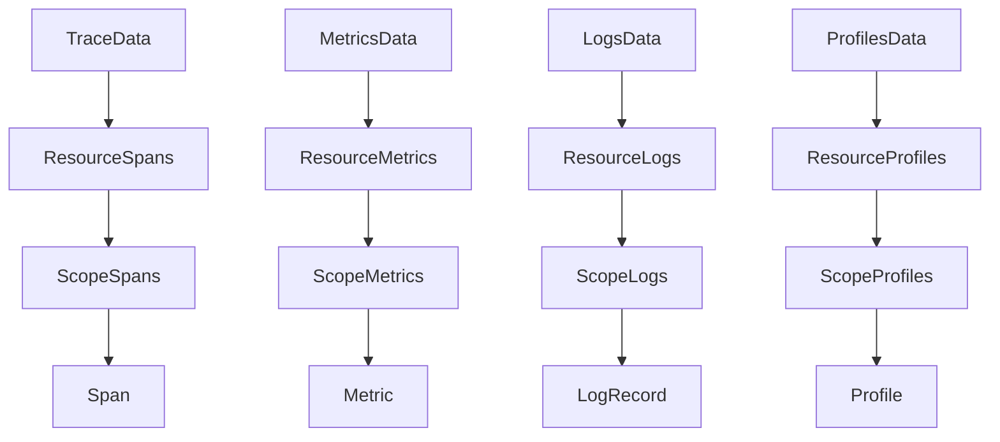
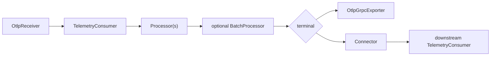

# Public API

The public API is the surface application authors should use. It lives in two modules:

- `dev.nthings.otlp4j.model`: pure OTLP domain records.
- `dev.nthings.otlp4j.api`: receivers, exporters, processors, connectors, pipeline contracts, and the transport SPI.

`dev.nthings.otlp4j.transport` is not a public programming surface. Add it at runtime when you want the built-in OTLP/gRPC transport.

## Domain model

The model module contains immutable records that mirror OTLP's resource/scope/signal hierarchy:



Flattening helpers are available for common consumers:

- `TraceData.spans()`
- `MetricsData.metrics()`
- `LogsData.logRecords()`
- `ProfilesData.profiles()`

Attributes are represented by `Attributes` and the sealed `AttributeValue` family. Trace and span identifiers are lowercase hex strings in normal round trips, not byte arrays.

Prefer builders where they exist (`Span.builder()`, `Metric.builder()`, `Attributes.builder()`), because several canonical record constructors are intentionally close to the OTLP wire shape.

## Pipeline contract

`TelemetryConsumer` is the central abstraction. It has one method per OTLP signal:

- `consumeTraces(TraceData)`
- `consumeMetrics(MetricsData)`
- `consumeLogs(LogsData)`
- `consumeProfiles(ProfilesData)`

Methods default to `ExportResult.success()`, so a custom consumer only needs to override the signals it handles.

`ExportResult` represents the OTLP `partial_success` response:

- `success()` accepts the full batch.
- `partialSuccess(rejectedCount, message)` accepts part of the batch.
- `rejected(message)` reports whole-batch rejection without a per-item count.
- `and(...)` combines results when a component fans out to multiple downstreams.

Throw an exception when you want a transport-level failure instead of an OTLP partial-success response.

Most public API types fit this pipeline shape:



For a receiver that handles several signals in one place, implement `TelemetryConsumer` directly:

```java
var consumer = new TelemetryConsumer() {
    @Override
    public ExportResult consumeTraces(TraceData traces) {
        System.out.println("spans=" + traces.spans().size());
        return ExportResult.success();
    }

    @Override
    public ExportResult consumeMetrics(MetricsData metrics) {
        System.out.println("metrics=" + metrics.metrics().size());
        return ExportResult.success();
    }
};

var receiver = OtlpReceiver.builder()
        .consumer(consumer)
        .build()
        .start(4317);
```

## Receivers

`OtlpReceiver` is the ingest side of a pipeline:

```java
var receiver = OtlpReceiver.builder()
        .traceHandler(traces -> {
            System.out.println("received " + traces.spans().size() + " spans");
            return ExportResult.success();
        })
        .build()
        .start(4317);
```

Use `start(0)` in tests or demos to bind an ephemeral port, then read it with `port()`.

You can configure either:

- `consumer(...)` for a full `TelemetryConsumer`, `Pipeline`, `Connector`, or `Exporter`.
- Per-signal handlers such as `traceHandler(...)` and `metricsHandler(...)`.

If `consumer(...)` is set, it takes precedence over per-signal handlers.

A signal with neither a consumer nor a handler is still served and returns full success. That makes it possible to bring up a partial receiver without causing clients to fail unrelated signal exports.

## Exporters

`OtlpGrpcExporter` is the built-in OTLP/gRPC exporter:

```java
try (var exporter = OtlpGrpcExporter.builder()
        .endpoint("collector.example.com", 4317)
        .timeout(Duration.ofSeconds(5))
        .build()) {
    ExportResult result = exporter.consumeTraces(traces);
}
```

Defaults are `localhost:4317` and a 10 second timeout. The exporter implements `Exporter`, so it is also a `TelemetryConsumer` and can be used as a pipeline terminal.

The endpoint is configured as `host` and `port`, not as a URL. TLS and headers are not currently part of the public exporter configuration.

## Processors

`Processor` is a decorator factory: it wraps a downstream `TelemetryConsumer` and returns another consumer. Processors can be chained directly or assembled through `Pipeline`:

```java
var pipeline = Pipeline.builder()
        .process(Processors.setResourceAttribute(
                "deployment.environment", AttributeValue.of("prod")))
        .process(Processors.filterSpans(span -> span.kind() == Span.Kind.SERVER))
        .into(exporter);
```

Built-in processors currently support span filtering, log-record filtering, and resource attribute enrichment. Signals a processor does not handle pass through unchanged.

`BatchProcessor` is the stateful processor for coalescing small exports before forwarding them:

```java
try (var batch = BatchProcessor.builder()
        .downstream(exporter)
        .maxBatchSize(512)
        .build()) {
    OtlpReceiver.builder().consumer(batch).build().start(4317);
    batch.flush();
}
```

Each signal is buffered independently and flushed when its item count reaches `maxBatchSize`. There is no background flush thread; call `flush()` on your own cadence or `close()` during shutdown to drain batches that stayed below the threshold.

## Connectors

`Connector` is for deriving telemetry from telemetry. Unlike a processor, it does not have to forward the signal it consumed and may emit a different signal type downstream.

`CountConnector` is the built-in example:

```java
TelemetryConsumer spanCounts = new CountConnector(metricsExporter);
```

It consumes traces and logs, then emits delta-sum metrics with item counts into the downstream metrics consumer.

## Transport SPI

The SPI package is public so alternate transports can be supplied:

- Implement `OtlpServerProvider` and `OtlpServer` for receiver-side transport.
- Implement `OtlpClientProvider` and `OtlpClient` for exporter-side transport.
- Register providers with JPMS `provides` declarations, `META-INF/services`, or both.

The built-in transport is selected through `ServiceLoader`. Current API helpers use the first provider found for each SPI service.

## Signal coverage and limitations

- Traces, metrics, logs, and profiles have receive/export paths.
- Profiles use OpenTelemetry `v1development`; the domain model exposes stable top-level metadata and intentionally omits detailed sample/location/mapping/dictionary tables.
- Metric exemplars are not modeled.
- The built-in transport is plaintext gRPC only.
- Generated proto and gRPC types are intentionally not exposed through the public API.
