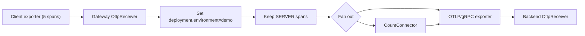

# otlp4j samples

This module contains the runnable end-to-end demo for otlp4j. It is intentionally small: it proves
the public API, SPI wiring, transport, processors, connectors, and typed model work together without
letting generated proto or gRPC types leak into sample code.

## Demo topology

`OtlpE2eDemo` wires this flow:



The client sends five spans. Three `SERVER` spans survive the filter, the backend receives those
three spans with the enriched resource attribute, and `CountConnector` emits a
`otlp4j.connector.span.count` metric with value `3`.

## Run the sample check

From the repository root:

```sh
./mvnw -B -pl otlp4j-samples -am test -Dtest=OtlpE2eDemoTest -Dsurefire.failIfNoSpecifiedTests=false
```

The test executes the demo with ephemeral ports, so it does not need a local collector or a fixed
port. It asserts the expected outcome directly: three spans reach the backend, the derived
span-count metric is `3`, and the surviving trace resource has `deployment.environment=demo`.

## What the sample demonstrates

- `otlp4j-samples` compiles against `otlp4j-api` only.
- `otlp4j-transport` is present only at runtime and is discovered through the SPI.
- Telemetry crosses two real plaintext OTLP/gRPC hops.
- Pipeline processors can enrich and filter batches before export.
- A connector can derive metrics from traces.
- The sample code never imports generated proto or gRPC classes.

## Optional package profiles

The module also defines packaging profiles:

```sh
./mvnw -B -pl otlp4j-samples -am package -Pnative
./mvnw -B -pl otlp4j-samples -am package -Pjlink
```

`native` requires a GraalVM JDK on `JAVA_HOME`. `jlink` builds a linked runtime image for the pure
API/sample side while keeping the runtime transport stack outside the linked closure.
