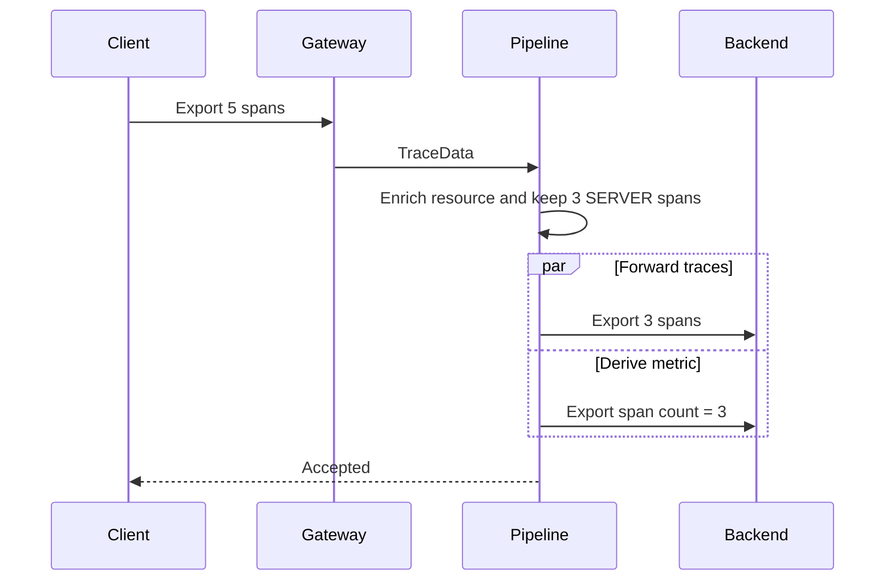

# End-to-end sample

`OtlpE2eDemo` verifies the public API and runtime-loaded transport together. The sample module compiles against `otlp4j-api`; `otlp4j-transport` is a runtime dependency, so the code cannot import generated proto or gRPC types.

## Scenario



Both receivers use ephemeral ports. The test asserts that the backend receives three spans, `deployment.environment=demo`, and an `otlp4j.connector.span.count` metric with value `3`.

Run it from the repository root:

```sh
./mvnw -B -pl otlp4j-samples -am test \
  -Dtest=OtlpE2eDemoTest \
  -Dsurefire.failIfNoSpecifiedTests=false
```

No external collector is required.

## Optional packaging

```sh
./mvnw -B -pl otlp4j-samples -am package -Pnative
./mvnw -B -pl otlp4j-samples -am package -Pjlink
```

The `native` profile requires a GraalVM JDK. The `jlink` profile creates the pure API/sample runtime image; the automatic-module transport stack remains outside the linked image.
