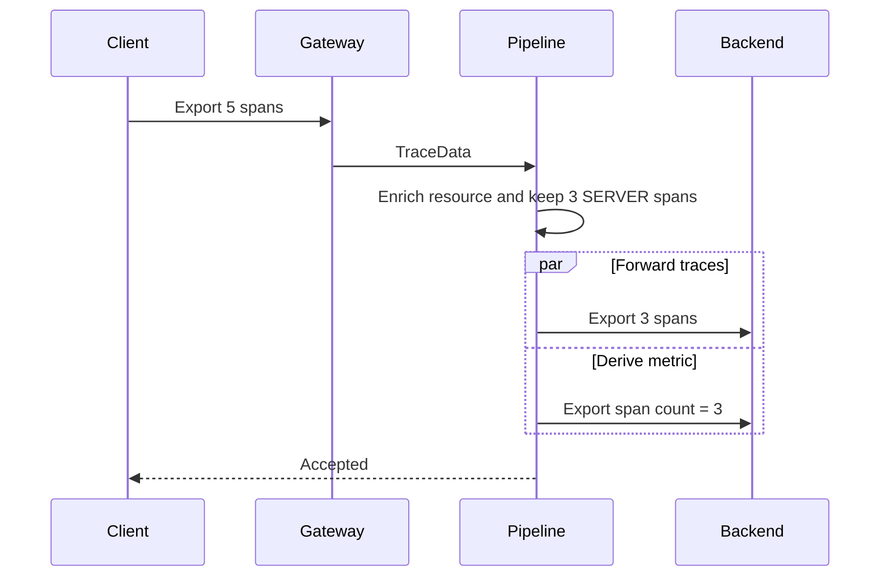

# End-to-end sample

`OtlpE2eDemo` exercises the public API and the bundled OTLP/gRPC transport together. The sample compiles against `otlp4j-api` (the pipeline DSL) and `otlp4j-transport-grpc` (the concrete `OtlpGrpcExporter`/`OtlpGrpcReceiver`); it never imports the generated proto or gRPC stub types, which stay encapsulated in `otlp4j-proto`.

## Scenario



Both receivers use ephemeral ports. The test asserts that the backend receives three spans, `deployment.environment=demo`, and an `otlp4j.connector.span.count` metric with value `3`.

Run it from the repository root:

```sh
./mvnw -B -pl otlp4j-samples -am test \
  -Dtest=OtlpE2eDemoTest \
  -Dsurefire.failIfNoSpecifiedTests=false
```

No external collector is required.

## Optional packaging

```sh
./mvnw -B -pl otlp4j-samples -am package -Pnative
./mvnw -B -pl otlp4j-samples -am package -Pjlink
```

The `native` profile requires a GraalVM JDK. The `jlink` profile creates the pure API/sample runtime image; the gRPC/Netty stack (automatic modules) remains outside the linked image.
